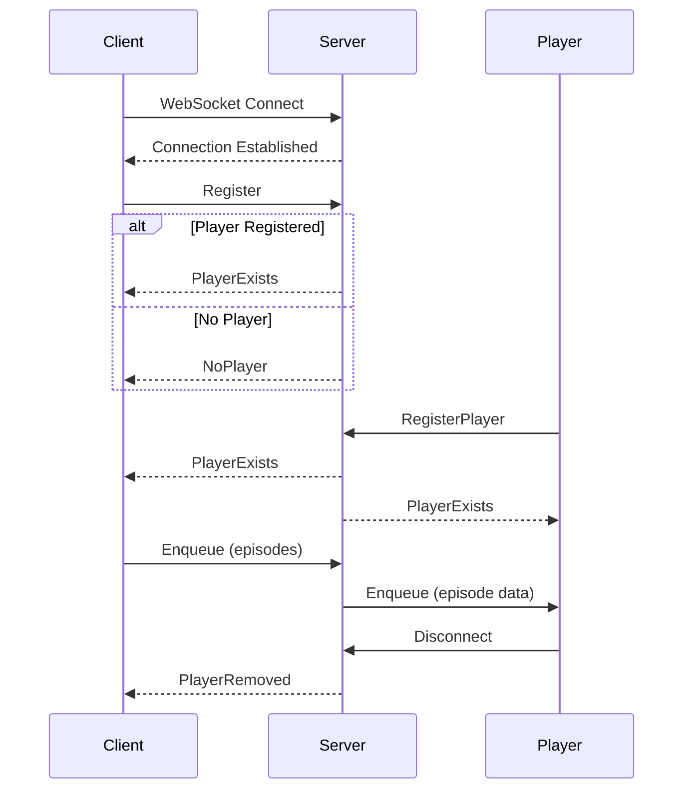

# WebSocket API

Real-time communication API for Podgrab using WebSocket protocol.

## Overview

Podgrab uses WebSockets for real-time bidirectional communication between the web interface and server, primarily for:

- Media player synchronization across browser tabs/windows
- Download progress notifications
- Live episode queue management
- UI state synchronization

## Connection

### WebSocket Endpoint

```
ws://localhost:8080/ws
```

For HTTPS deployments:
```
wss://your-domain.com/ws
```

### Connection Example (JavaScript)

```javascript
const ws = new WebSocket('ws://localhost:8080/ws');

ws.onopen = () => {
  console.log('WebSocket connected');
};

ws.onmessage = (event) => {
  const message = JSON.parse(event.data);
  console.log('Received:', message);
};

ws.onerror = (error) => {
  console.error('WebSocket error:', error);
};

ws.onclose = () => {
  console.log('WebSocket disconnected');
};
```

## Message Format

All WebSocket messages use JSON format:

```json
{
  "identifier": "unique-client-id",
  "messageType": "MessageTypeName",
  "payload": "JSON string or empty"
}
```

### Message Fields

| Field | Type | Description |
|-------|------|-------------|
| `identifier` | string | Unique client identifier (UUID) |
| `messageType` | string | Type of message (see below) |
| `payload` | string | JSON-encoded payload (optional) |

## Message Types

### Client to Server

#### Register

Register client connection and check for active player.

```json
{
  "identifier": "client-uuid",
  "messageType": "Register",
  "payload": ""
}
```

**Server Response:**
- `PlayerExists` if an active player is registered
- `NoPlayer` if no player is active

#### RegisterPlayer

Register this client as the active media player.

```json
{
  "identifier": "player-uuid",
  "messageType": "RegisterPlayer",
  "payload": ""
}
```

**Effect:**
- Registers client as the active player
- Broadcasts `PlayerExists` to all connected clients

#### Enqueue

Send episodes to the active player for playback.

```json
{
  "identifier": "client-uuid",
  "messageType": "Enqueue",
  "payload": "{\"itemIds\":[\"id1\",\"id2\"],\"podcastId\":\"\",\"tagIds\":[]}"
}
```

**Payload Structure:**
```json
{
  "itemIds": ["episode-uuid-1", "episode-uuid-2"],
  "podcastId": "podcast-uuid",
  "tagIds": ["tag-uuid-1", "tag-uuid-2"]
}
```

**Payload Options:**
- `itemIds`: Array of specific episode IDs to enqueue
- `podcastId`: Enqueue all episodes from a podcast
- `tagIds`: Enqueue all episodes from podcasts with these tags

**Server Behavior:**
1. Parses payload to determine episodes
2. Retrieves full episode data
3. Sends `Enqueue` message to active player with episode array

### Server to Client

#### PlayerExists

Indicates an active player is registered.

```json
{
  "identifier": "player-uuid",
  "messageType": "PlayerExists",
  "payload": ""
}
```

**Client Action:**
- Show "Cast to Player" UI elements
- Enable episode queueing functionality

#### NoPlayer

Indicates no active player is registered.

```json
{
  "identifier": "",
  "messageType": "NoPlayer",
  "payload": ""
}
```

**Client Action:**
- Hide "Cast to Player" UI elements
- Disable episode queueing functionality

#### PlayerRemoved

Notification that active player disconnected.

```json
{
  "identifier": "player-uuid",
  "messageType": "PlayerRemoved",
  "payload": ""
}
```

**Client Action:**
- Update UI to reflect no player available
- Clear player-related state

#### Enqueue (to Player)

Episodes to add to player queue.

```json
{
  "identifier": "player-uuid",
  "messageType": "Enqueue",
  "payload": "[{\"id\":\"uuid\",\"title\":\"Episode\",\"fileURL\":\"...\"}]"
}
```

**Payload:** JSON array of episode objects

**Player Action:**
- Parse episode array
- Add episodes to playback queue
- Optionally start playback

## Connection Lifecycle

### Connection Flow



### Cleanup on Disconnect

When a WebSocket connection closes:

1. **Player Connection**:
   - Removed from active players registry
   - `PlayerRemoved` message broadcast to all clients

2. **Client Connection**:
   - Removed from active connections registry
   - No broadcast to other clients

## Player Implementation

### Player Registration

```javascript
const playerId = generateUUID();
const ws = new WebSocket('ws://localhost:8080/ws');

ws.onopen = () => {
  // Register as player
  ws.send(JSON.stringify({
    identifier: playerId,
    messageType: 'RegisterPlayer',
    payload: ''
  }));
};
```

### Receiving Enqueue Messages

```javascript
ws.onmessage = (event) => {
  const message = JSON.parse(event.data);

  if (message.messageType === 'Enqueue') {
    const episodes = JSON.parse(message.payload);

    // Add to player queue
    episodes.forEach(episode => {
      addToQueue({
        id: episode.id,
        title: episode.title,
        audioUrl: `/podcastitems/${episode.id}/file`,
        imageUrl: `/podcastitems/${episode.id}/image`,
        duration: episode.duration,
        podcast: episode.podcast.title
      });
    });

    // Optionally start playback
    if (!isPlaying()) {
      play();
    }
  }
};
```

## Client Implementation

### Checking for Player

```javascript
const clientId = generateUUID();
const ws = new WebSocket('ws://localhost:8080/ws');

ws.onopen = () => {
  // Check if player exists
  ws.send(JSON.stringify({
    identifier: clientId,
    messageType: 'Register',
    payload: ''
  }));
};

ws.onmessage = (event) => {
  const message = JSON.parse(event.data);

  if (message.messageType === 'PlayerExists') {
    showCastButton();
  } else if (message.messageType === 'NoPlayer') {
    hideCastButton();
  }
};
```

### Enqueueing Episodes

```javascript
function castToPlayer(episodeIds) {
  const payload = {
    itemIds: episodeIds,
    podcastId: '',
    tagIds: []
  };

  ws.send(JSON.stringify({
    identifier: clientId,
    messageType: 'Enqueue',
    payload: JSON.stringify(payload)
  }));
}

// Usage
castToPlayer(['episode-uuid-1', 'episode-uuid-2']);
```

### Enqueueing Podcast

```javascript
function castPodcast(podcastId) {
  const payload = {
    itemIds: [],
    podcastId: podcastId,
    tagIds: []
  };

  ws.send(JSON.stringify({
    identifier: clientId,
    messageType: 'Enqueue',
    payload: JSON.stringify(payload)
  });
}
```

### Enqueueing by Tags

```javascript
function castByTags(tagIds) {
  const payload = {
    itemIds: [],
    podcastId: '',
    tagIds: tagIds
  };

  ws.send(JSON.stringify({
    identifier: clientId,
    messageType: 'Enqueue',
    payload: JSON.stringify(payload)
  });
}
```

## Error Handling

### Connection Errors

```javascript
ws.onerror = (error) => {
  console.error('WebSocket error:', error);
  showNotification('Connection error. Retrying...');

  // Implement reconnection logic
  setTimeout(() => {
    reconnect();
  }, 5000);
};
```

### Reconnection Strategy

```javascript
let reconnectAttempts = 0;
const maxReconnectAttempts = 5;
const reconnectDelay = 2000;

function reconnect() {
  if (reconnectAttempts < maxReconnectAttempts) {
    reconnectAttempts++;
    const delay = reconnectDelay * reconnectAttempts;

    setTimeout(() => {
      ws = new WebSocket('ws://localhost:8080/ws');
      setupWebSocket(ws);
    }, delay);
  } else {
    showNotification('Failed to reconnect. Please refresh the page.');
  }
}

ws.onopen = () => {
  reconnectAttempts = 0; // Reset on successful connection
};
```

### Invalid Message Handling

```javascript
ws.onmessage = (event) => {
  try {
    const message = JSON.parse(event.data);
    handleMessage(message);
  } catch (error) {
    console.error('Invalid message format:', error);
  }
};
```

## Security Considerations

### Authentication

WebSocket connections inherit HTTP authentication:

- If `PASSWORD` environment variable is set, WebSocket upgrade requires Basic Auth
- Credentials must be included in initial HTTP request
- No separate WebSocket-level authentication

### Example with Authentication

```javascript
const username = 'podgrab';
const password = 'your-password';
const credentials = btoa(`${username}:${password}`);

const ws = new WebSocket('ws://localhost:8080/ws', {
  headers: {
    'Authorization': `Basic ${credentials}`
  }
});
```

**Note:** Browser WebSocket API doesn't support custom headers. For authenticated connections, use authenticated HTTP session or query parameters.

### Data Validation

- All message payloads are JSON-parsed on server
- Invalid JSON payloads are logged but don't crash server
- Client should validate received data before processing

## Use Cases

### Multi-Tab Playback Sync

**Scenario:** User has podcast player open in one tab and browses episodes in another.

1. Tab A opens player and registers: `RegisterPlayer`
2. Tab B registers and receives: `PlayerExists`
3. User clicks "Play Now" in Tab B
4. Tab B sends: `Enqueue` with episode IDs
5. Tab A receives: `Enqueue` and starts playback

### Playback Handoff

**Scenario:** User switches from mobile to desktop browser.

1. Mobile player registers
2. Desktop browser connects and sees `PlayerExists`
3. User closes mobile browser
4. Desktop receives `PlayerRemoved`
5. Desktop can now register its own player

### Download Progress (Future Enhancement)

WebSocket infrastructure is in place for future download progress notifications:

```json
{
  "messageType": "DownloadProgress",
  "payload": "{\"episodeId\":\"uuid\",\"percent\":45,\"speed\":\"2.5 MB/s\"}"
}
```

## Performance Considerations

### Connection Limits

- No artificial connection limits
- Limited by system resources (file descriptors, memory)
- Typical deployment handles 100+ concurrent connections

### Message Size

- Episode list payloads can be large (100+ episodes)
- Consider pagination for very large playlists
- JSON payload size typically 1-100 KB

### Heartbeat/Ping-Pong

- No built-in heartbeat mechanism
- Browser handles connection health automatically
- Consider implementing application-level ping for long-lived connections

## Debugging

### Enable WebSocket Logging

Browser console shows WebSocket frames:

```javascript
ws.addEventListener('message', (event) => {
  console.log('WS Received:', event.data);
});

const originalSend = ws.send;
ws.send = function(data) {
  console.log('WS Sent:', data);
  originalSend.call(this, data);
};
```

### Server-Side Logging

WebSocket handler logs to stdout:

- "Player Registered" when player connects
- "Player Removed" when player disconnects
- Payload parsing errors

## Related Documentation

- [REST API](rest-api.md) - HTTP endpoints
- [User Guide](../guides/user-guide.md) - Using the player
- [Architecture Overview](../architecture/overview.md) - System design
