# Data Flow

This document details how data flows through Podgrab for various operations, including request/response patterns, background job flows, and real-time update mechanisms.

## Core Data Flows

### 1. Add Podcast Flow

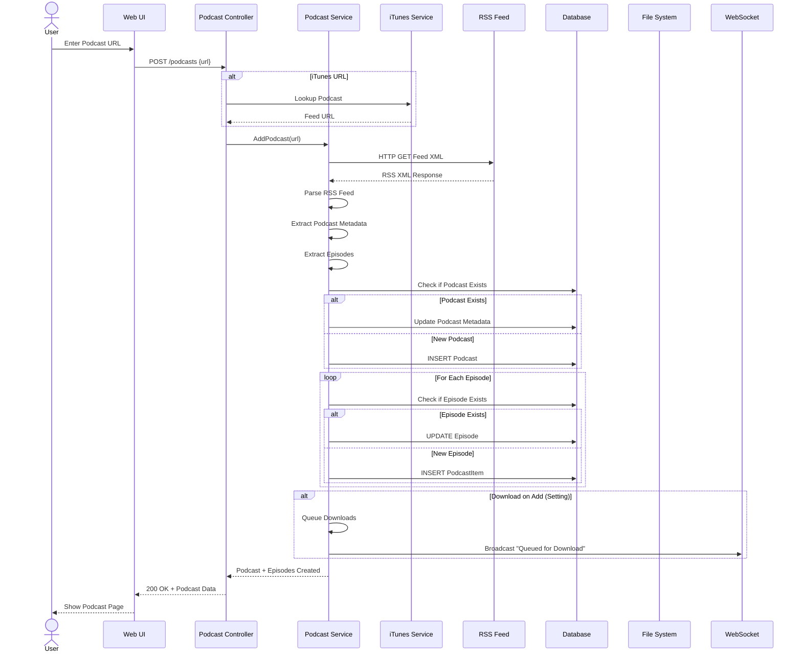

### 2. Episode Download Flow

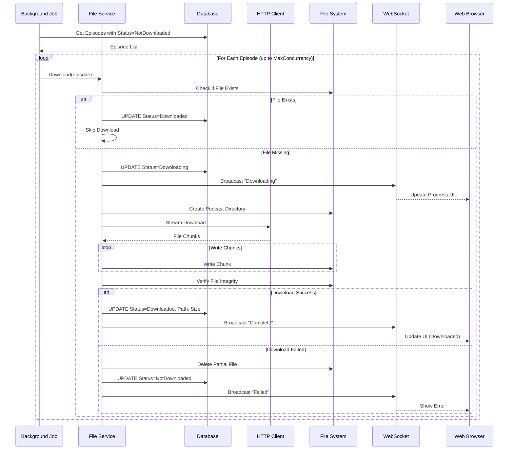

### 3. RSS Feed Refresh Flow

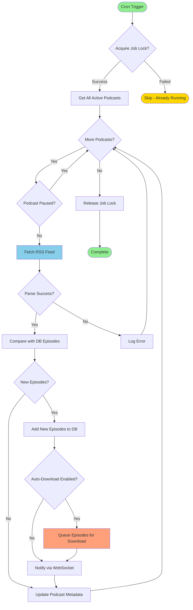

### 4. WebSocket Real-time Updates

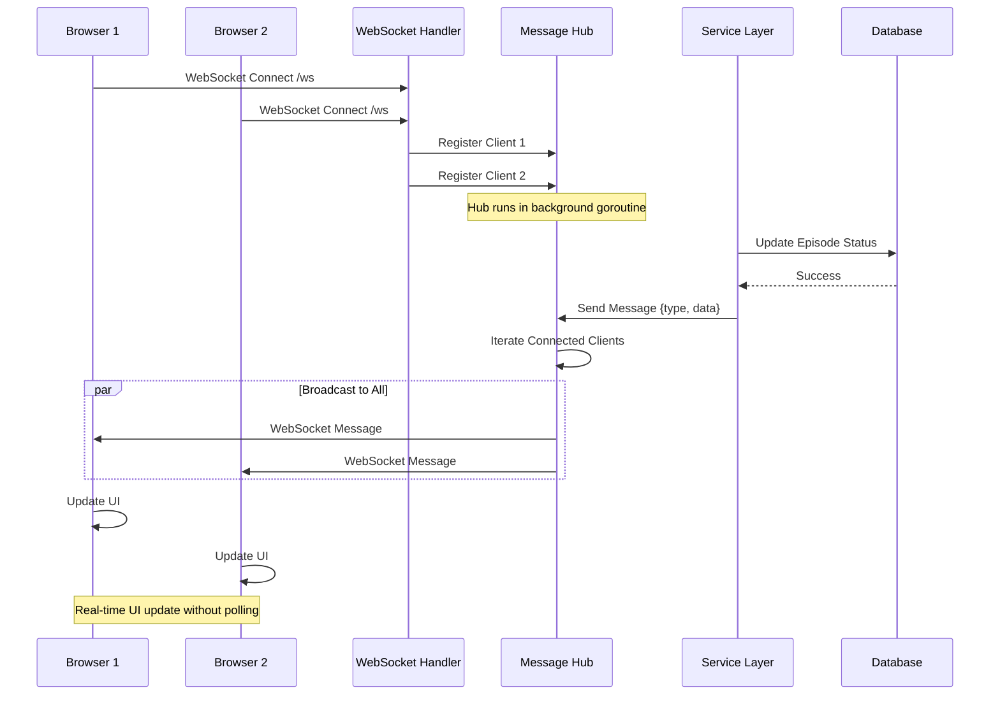

## Data Transformation Flows

### RSS to Database

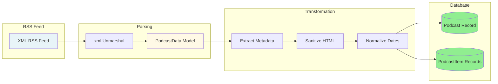

**Transformation Steps**:
1. **XML Parsing**: `encoding/xml` → `model.PodcastData`
2. **HTML Sanitization**: `bluemonday` removes unsafe HTML
3. **Text Cleanup**: `html-strip-tags-go` removes all HTML tags
4. **Date Parsing**: RFC822/RFC3339 → `time.Time`
5. **URL Validation**: Ensure valid episode file URLs
6. **GUID Extraction**: Use GUID for episode uniqueness

### File Download to Storage

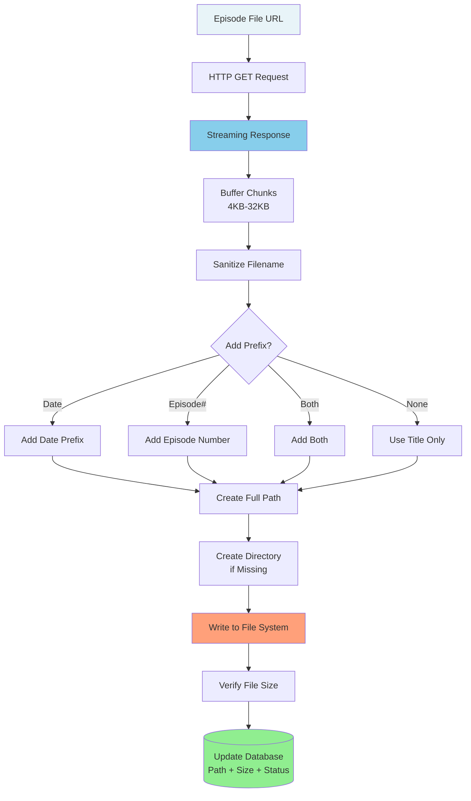

## Request/Response Patterns

### REST API Patterns

#### List Resources (GET)

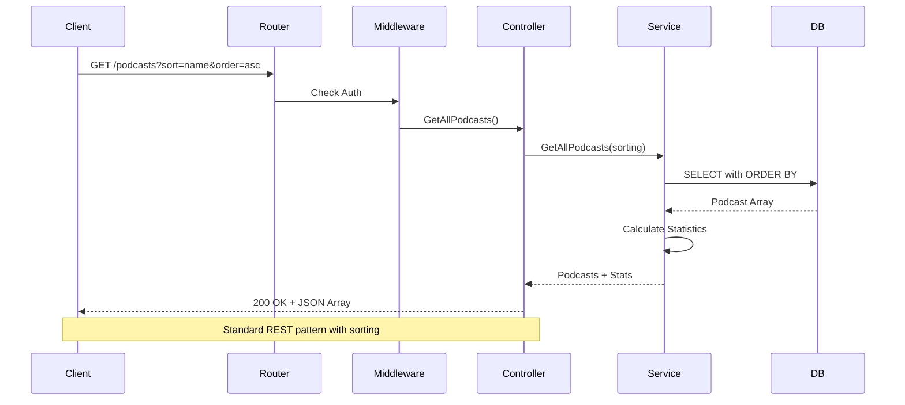

#### Get Single Resource (GET)

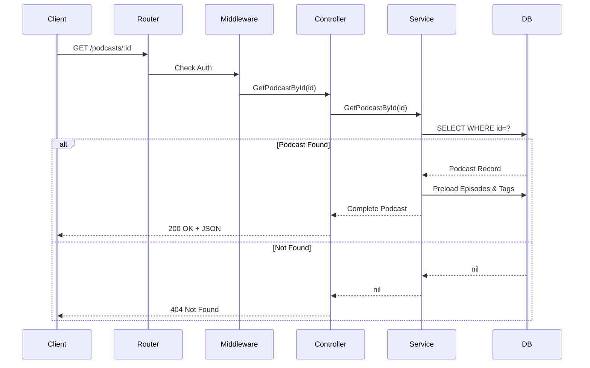

#### Create Resource (POST)

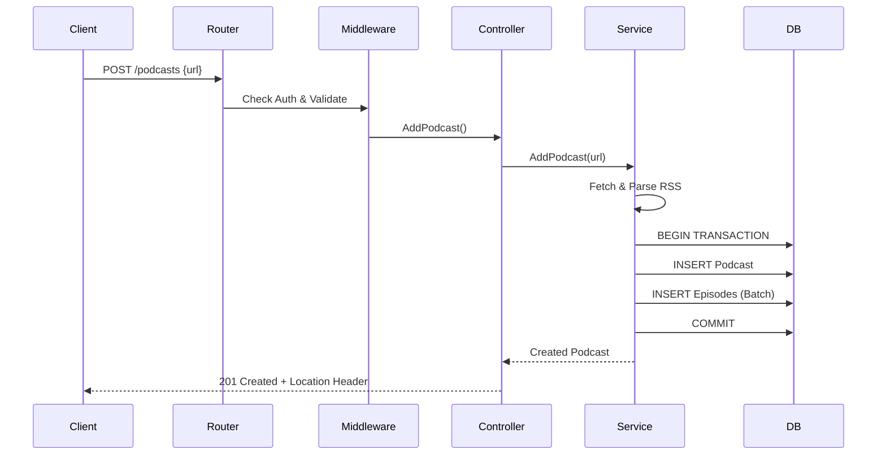

#### Update Resource (PATCH)

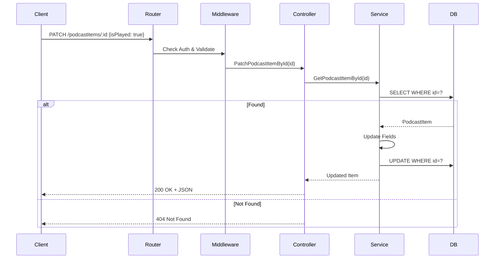

#### Delete Resource (DELETE)

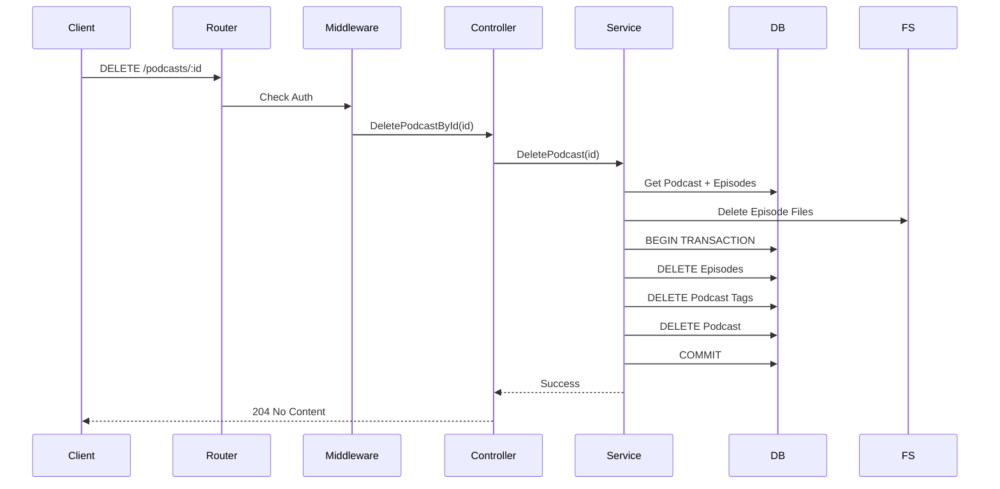

### HTML Page Rendering

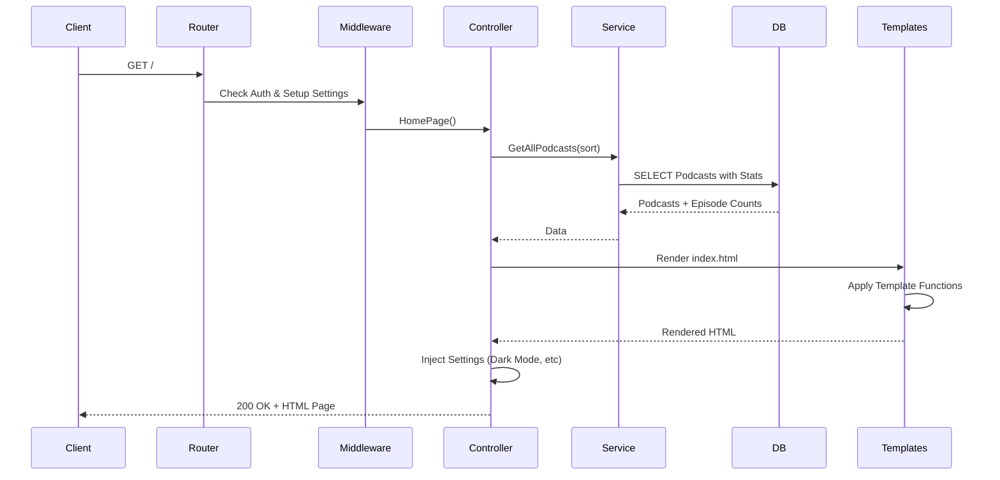

## Background Job Data Flow

### Job Execution Pattern

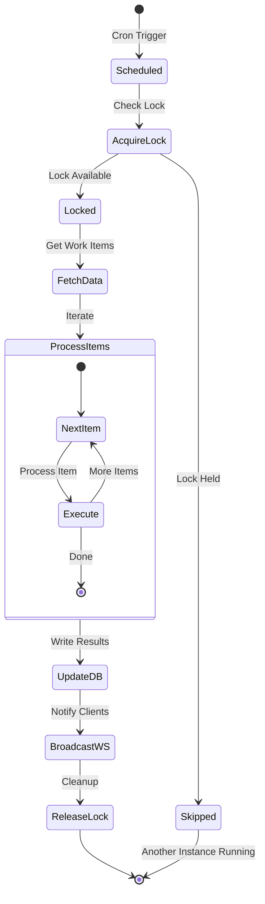

### Parallel Download Processing

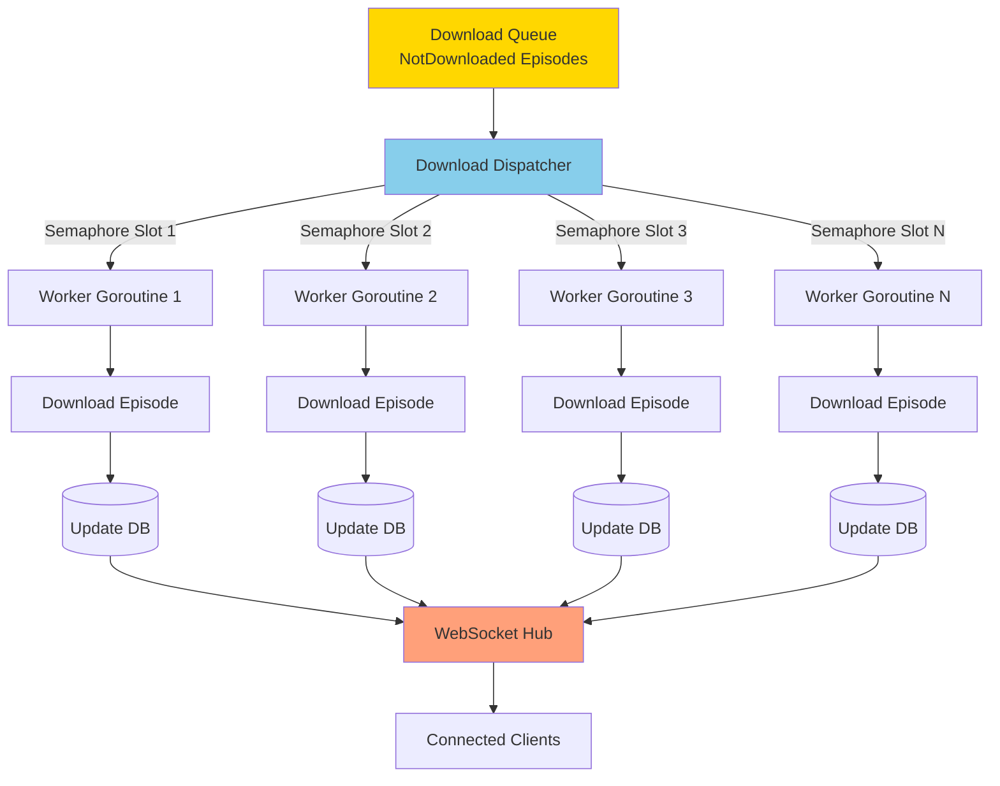

## Data Consistency Patterns

### Optimistic Locking (via GORM)

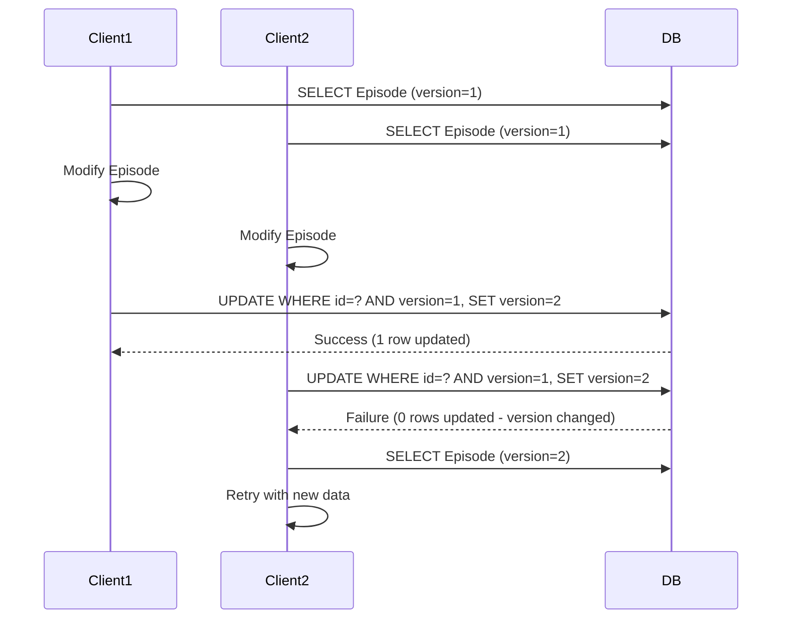

### Job Lock Pattern

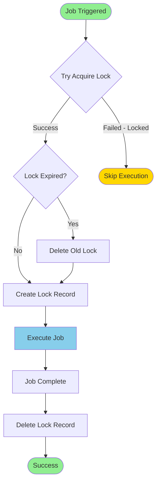

## Error Flow Patterns

### Download Error Recovery

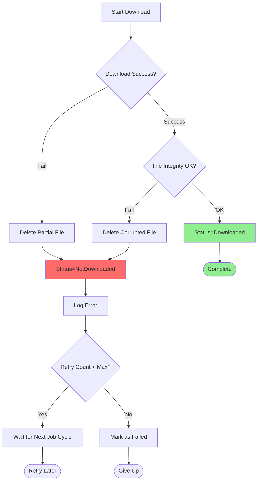

### RSS Parse Error Handling

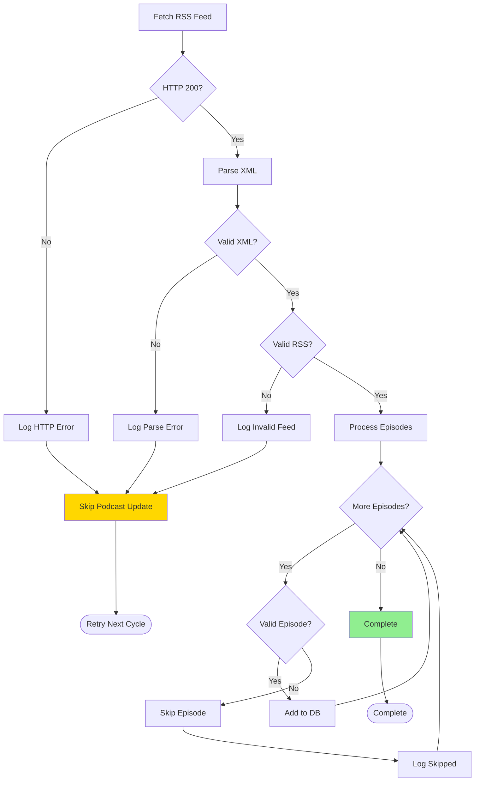

## Related Documentation

- [Overview](overview.md) - System architecture
- [System Design](system-design.md) - Design patterns
- [Database Schema](database-schema.md) - Data model
- [REST API](../api/rest-api.md) - API reference

---

**Next Steps**: Review [Database Schema](database-schema.md) for detailed data model documentation.