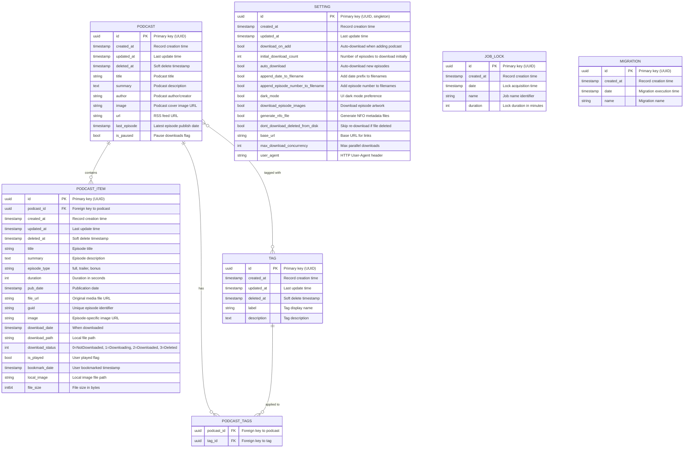
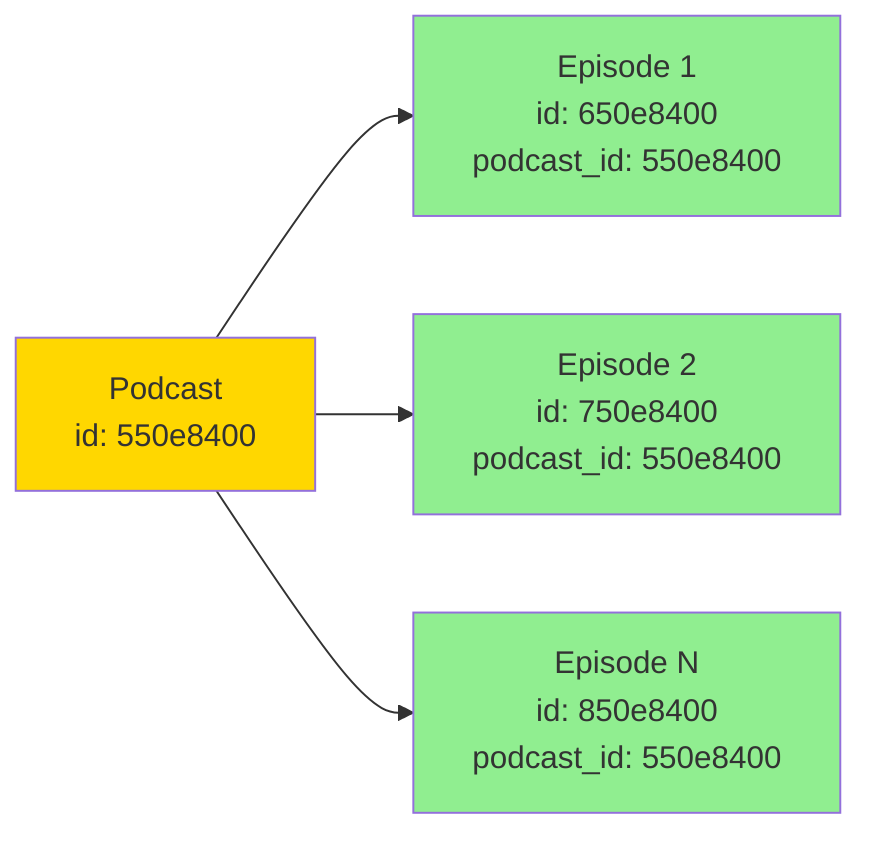

# Database Schema

This document provides detailed documentation of Podgrab's SQLite database schema, including tables, relationships, indexes, and constraints.

## Entity Relationship Diagram



## Table Definitions

### podcasts

**Purpose**: Stores podcast (RSS feed) metadata

| Column | Type | Constraints | Description |
|--------|------|-------------|-------------|
| id | VARCHAR(36) | PRIMARY KEY | UUID identifier |
| created_at | TIMESTAMP | NOT NULL | Record creation timestamp |
| updated_at | TIMESTAMP | NOT NULL | Last update timestamp |
| deleted_at | TIMESTAMP | NULL | Soft delete timestamp (NULL = active) |
| title | VARCHAR(255) | NOT NULL | Podcast name |
| summary | TEXT | | Full description (HTML stripped) |
| author | VARCHAR(255) | | Creator/author name |
| image | VARCHAR(512) | | Cover image URL |
| url | VARCHAR(512) | NOT NULL UNIQUE | RSS feed URL |
| last_episode | TIMESTAMP | NULL | Most recent episode pub date |
| is_paused | BOOLEAN | DEFAULT FALSE | Pause new downloads |

**Indexes**:
- PRIMARY KEY on `id`
- UNIQUE INDEX on `url`
- INDEX on `deleted_at` (for soft delete queries)
- INDEX on `created_at` (for sorting)
- INDEX on `last_episode` (for sorting)

**Example Record**:
```sql
INSERT INTO podcasts (id, title, url, author, is_paused)
VALUES (
    '550e8400-e29b-41d4-a716-446655440000',
    'The Daily Podcast',
    'https://example.com/feed.xml',
    'Example Media',
    0
);
```

### podcast_items

**Purpose**: Stores individual podcast episodes

| Column | Type | Constraints | Description |
|--------|------|-------------|-------------|
| id | VARCHAR(36) | PRIMARY KEY | UUID identifier |
| podcast_id | VARCHAR(36) | FOREIGN KEY | References podcasts(id) |
| created_at | TIMESTAMP | NOT NULL | Record creation timestamp |
| updated_at | TIMESTAMP | NOT NULL | Last update timestamp |
| deleted_at | TIMESTAMP | NULL | Soft delete timestamp |
| title | VARCHAR(255) | NOT NULL | Episode title |
| summary | TEXT | | Episode description |
| episode_type | VARCHAR(50) | | full/trailer/bonus |
| duration | INTEGER | | Duration in seconds |
| pub_date | TIMESTAMP | NOT NULL | Publication date |
| file_url | VARCHAR(1024) | NOT NULL | Original media URL |
| guid | VARCHAR(512) | NOT NULL | Unique episode ID from RSS |
| image | VARCHAR(512) | | Episode-specific image URL |
| download_date | TIMESTAMP | NULL | When file was downloaded |
| download_path | VARCHAR(512) | | Local file path |
| download_status | INTEGER | DEFAULT 0 | 0/1/2/3 (see below) |
| is_played | BOOLEAN | DEFAULT FALSE | User played status |
| bookmark_date | TIMESTAMP | NULL | Bookmark timestamp |
| local_image | VARCHAR(512) | | Local image file path |
| file_size | BIGINT | DEFAULT 0 | File size in bytes |

**Download Status Enum**:
```go
const (
    NotDownloaded DownloadStatus = 0  // Queued or not started
    Downloading   DownloadStatus = 1  // Currently downloading
    Downloaded    DownloadStatus = 2  // Successfully downloaded
    Deleted       DownloadStatus = 3  // File was deleted
)
```

**Indexes**:
- PRIMARY KEY on `id`
- INDEX on `podcast_id` (foreign key)
- INDEX on `guid, podcast_id` (uniqueness check)
- INDEX on `download_status` (query filtering)
- INDEX on `pub_date` (sorting)

**Example Record**:
```sql
INSERT INTO podcast_items (
    id, podcast_id, title, guid, file_url, pub_date, download_status
) VALUES (
    '650e8400-e29b-41d4-a716-446655440000',
    '550e8400-e29b-41d4-a716-446655440000',
    'Episode 1: Getting Started',
    'podcast-ep001',
    'https://example.com/episode1.mp3',
    '2024-01-15 10:00:00',
    2
);
```

### tags

**Purpose**: Organizational labels for podcasts

| Column | Type | Constraints | Description |
|--------|------|-------------|-------------|
| id | VARCHAR(36) | PRIMARY KEY | UUID identifier |
| created_at | TIMESTAMP | NOT NULL | Record creation timestamp |
| updated_at | TIMESTAMP | NOT NULL | Last update timestamp |
| deleted_at | TIMESTAMP | NULL | Soft delete timestamp |
| label | VARCHAR(100) | NOT NULL UNIQUE | Tag display name |
| description | TEXT | | Tag description |

**Indexes**:
- PRIMARY KEY on `id`
- UNIQUE INDEX on `label`

### podcast_tags

**Purpose**: Many-to-many relationship between podcasts and tags

| Column | Type | Constraints | Description |
|--------|------|-------------|-------------|
| podcast_id | VARCHAR(36) | FOREIGN KEY | References podcasts(id) |
| tag_id | VARCHAR(36) | FOREIGN KEY | References tags(id) |

**Constraints**:
- PRIMARY KEY on `(podcast_id, tag_id)`
- FOREIGN KEY `podcast_id` REFERENCES `podcasts(id)` ON DELETE CASCADE
- FOREIGN KEY `tag_id` REFERENCES `tags(id)` ON DELETE CASCADE

**Indexes**:
- INDEX on `podcast_id`
- INDEX on `tag_id`

### settings

**Purpose**: Global application configuration (singleton table)

| Column | Type | Default | Description |
|--------|------|---------|-------------|
| id | VARCHAR(36) | | UUID (only 1 record) |
| created_at | TIMESTAMP | | Record creation |
| updated_at | TIMESTAMP | | Last update |
| download_on_add | BOOLEAN | TRUE | Auto-download when adding podcast |
| initial_download_count | INTEGER | 5 | Episodes to download initially |
| auto_download | BOOLEAN | TRUE | Auto-download new episodes |
| append_date_to_filename | BOOLEAN | FALSE | Add date prefix to files |
| append_episode_number_to_filename | BOOLEAN | FALSE | Add episode number to files |
| dark_mode | BOOLEAN | FALSE | UI dark mode |
| download_episode_images | BOOLEAN | FALSE | Download episode artwork |
| generate_nfo_file | BOOLEAN | FALSE | Generate NFO files |
| dont_download_deleted_from_disk | BOOLEAN | FALSE | Skip re-download if deleted |
| base_url | VARCHAR(512) | | Base URL for links |
| max_download_concurrency | INTEGER | 5 | Max parallel downloads |
| user_agent | VARCHAR(512) | | HTTP User-Agent |

**Note**: Only one row should exist. Created automatically on first app start.

### job_locks

**Purpose**: Prevent duplicate background job execution

| Column | Type | Constraints | Description |
|--------|------|-------------|-------------|
| id | VARCHAR(36) | PRIMARY KEY | UUID identifier |
| created_at | TIMESTAMP | NOT NULL | Record creation |
| date | TIMESTAMP | NOT NULL | Lock acquisition time |
| name | VARCHAR(100) | NOT NULL UNIQUE | Job identifier |
| duration | INTEGER | | Lock duration (minutes) |

**Lock Pattern**:
1. Job attempts to INSERT lock record
2. If INSERT succeeds → job executes
3. If INSERT fails (duplicate name) → job skips
4. Job deletes lock on completion
5. Stale locks cleaned by `UnlockMissedJobs()`

### migrations

**Purpose**: Track database schema migrations

| Column | Type | Constraints | Description |
|--------|------|-------------|-------------|
| id | VARCHAR(36) | PRIMARY KEY | UUID identifier |
| created_at | TIMESTAMP | NOT NULL | Record creation |
| date | TIMESTAMP | NOT NULL | Migration execution time |
| name | VARCHAR(255) | NOT NULL UNIQUE | Migration identifier |

## Relationships

### One-to-Many: Podcast → PodcastItems



**Query**: Get all episodes for a podcast
```sql
SELECT * FROM podcast_items
WHERE podcast_id = '550e8400-e29b-41d4-a716-446655440000'
AND deleted_at IS NULL
ORDER BY pub_date DESC;
```

### Many-to-Many: Podcasts ↔ Tags

```mermaid
graph TD
    subgraph Podcasts
        P1[Podcast 1]
        P2[Podcast 2]
        P3[Podcast 3]
    end

    subgraph "Join Table: podcast_tags"
        J1[P1 - Tech]
        J2[P1 - News]
        J3[P2 - News]
        J4[P3 - Tech]
    end

    subgraph Tags
        T1[Tech]
        T2[News]
    end

    P1 --> J1 & J2
    P2 --> J3
    P3 --> J4

    J1 & J4 --> T1
    J2 & J3 --> T2

    style Podcasts fill:#FFD700
    style Tags fill:#90EE90
    style "Join Table: podcast_tags" fill:#87CEEB
```

**Query**: Get all podcasts with "Tech" tag
```sql
SELECT p.* FROM podcasts p
INNER JOIN podcast_tags pt ON p.id = pt.podcast_id
INNER JOIN tags t ON pt.tag_id = t.id
WHERE t.label = 'Tech'
AND p.deleted_at IS NULL;
```

## Common Queries

### Dashboard Statistics

```sql
-- Get podcast counts by download status
SELECT
    p.id,
    p.title,
    COUNT(CASE WHEN pi.download_status = 2 THEN 1 END) as downloaded,
    COUNT(CASE WHEN pi.download_status = 0 THEN 1 END) as pending,
    COUNT(*) as total,
    SUM(CASE WHEN pi.download_status = 2 THEN pi.file_size ELSE 0 END) as total_size
FROM podcasts p
LEFT JOIN podcast_items pi ON p.id = pi.podcast_id AND pi.deleted_at IS NULL
WHERE p.deleted_at IS NULL
GROUP BY p.id;
```

### Recent Episodes

```sql
-- Get 50 most recent episodes across all podcasts
SELECT
    pi.*,
    p.title as podcast_title,
    p.image as podcast_image
FROM podcast_items pi
INNER JOIN podcasts p ON pi.podcast_id = p.id
WHERE pi.deleted_at IS NULL
AND p.deleted_at IS NULL
ORDER BY pi.pub_date DESC
LIMIT 50;
```

### Download Queue

```sql
-- Get next episodes to download
SELECT pi.*, p.title as podcast_title
FROM podcast_items pi
INNER JOIN podcasts p ON pi.podcast_id = p.id
WHERE pi.download_status = 0  -- NotDownloaded
AND pi.deleted_at IS NULL
AND p.is_paused = 0
AND p.deleted_at IS NULL
ORDER BY pi.pub_date DESC
LIMIT 10;
```

## Data Integrity Rules

### Soft Deletes

All main tables use soft deletes via `deleted_at`:
- NULL = active record
- NOT NULL = logically deleted

**Always include in queries**:
```sql
WHERE deleted_at IS NULL
```

### Cascade Deletes

When deleting podcasts:
1. Set `podcast_items.deleted_at` for all episodes
2. Delete from `podcast_tags` join table
3. Set `podcasts.deleted_at`

Actual files remain until explicitly deleted via "Delete Files" action.

### Unique Constraints

- `podcasts.url`: One entry per RSS feed
- `tags.label`: One tag per name
- `podcast_items.guid + podcast_id`: One episode per podcast
- `settings.id`: Singleton table

## Performance Considerations

### Query Optimization

**Fast Queries** (indexed):
- Get podcast by ID
- Get episodes by podcast_id
- Get episodes by download_status
- Sort by created_at, pub_date, last_episode

**Slower Queries** (full scan):
- Search podcast titles (LIKE)
- Search episode summaries (LIKE)
- Complex tag filtering

### Database Size Estimation

**Typical Podcast**:
- 1 Podcast record: ~1 KB
- 100 Episodes: ~50 KB
- Total: ~51 KB

**Large Collection (100 podcasts, 10,000 episodes)**:
- Database size: ~5-10 MB
- Add indexes: ~2-5 MB
- Total: ~10-15 MB

SQLite performs well with databases up to several GB.

## Backup Strategy

**Automated Backups**:
- Frequency: Every 2 days (configurable via `CHECK_FREQUENCY`)
- Location: `{CONFIG}/backups/`
- Format: SQLite database file copy
- Retention: Manual cleanup required

**Manual Backup**:
```bash
sqlite3 /config/podgrab.db ".backup /config/backups/manual-backup.db"
```

## Migration Strategy

**Current Approach**: GORM AutoMigrate
- Runs on application startup
- Adds new columns/tables automatically
- Does NOT remove columns (safe)
- Does NOT alter column types (requires manual migration)

**Manual Migrations**: Handled in `db/migrations.go`

## Related Documentation

- [Overview](overview.md) - System architecture
- [System Design](system-design.md) - Design patterns
- [Data Flow](data-flow.md) - Request flows
- [REST API](../api/rest-api.md) - API endpoints

---

**Next Steps**: Review [REST API Documentation](../api/rest-api.md) for endpoint details.