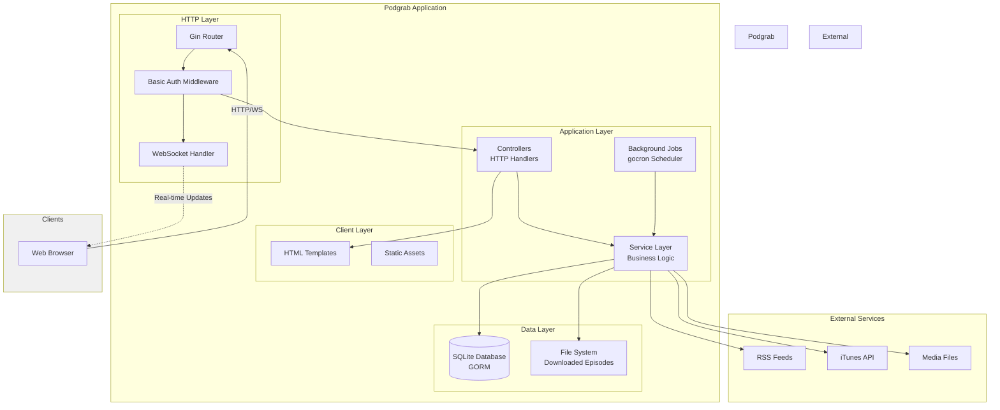
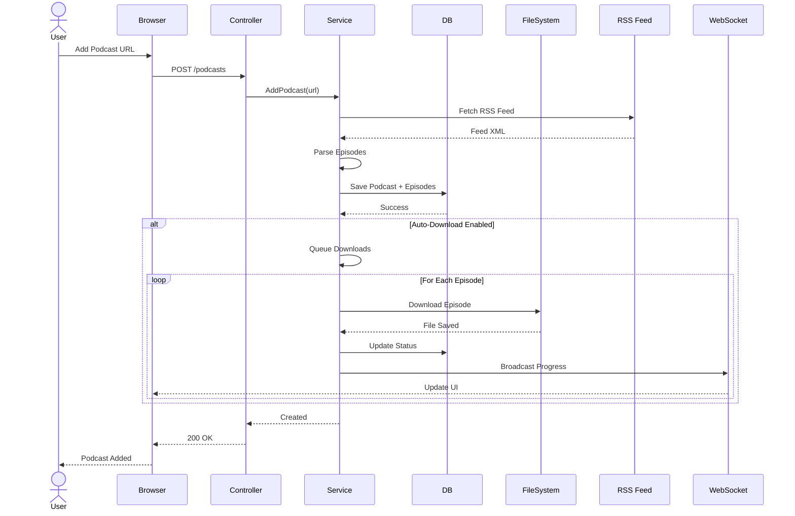
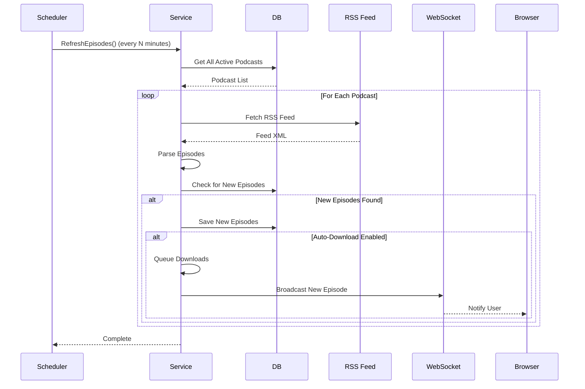

# Architecture Overview

This document provides a high-level overview of Podgrab's system architecture, including component interactions, data flow, and key design decisions.

## System Overview

Podgrab is a self-hosted podcast manager built as a monolithic web application with the following characteristics:

- **Backend**: Go 1.15+ with Gin web framework
- **Database**: SQLite with GORM ORM
- **Frontend**: Server-side HTML templates with minimal JavaScript
- **Background Jobs**: Scheduled tasks using gocron
- **Real-time Updates**: WebSocket for live progress updates

## High-Level Architecture



## Component Architecture

```mermaid
graph LR
    subgraph "Presentation Layer"
        Pages[Page Controllers]
        API[API Controllers]
        WS[WebSocket Handler]
    end

    subgraph "Business Logic Layer"
        PodSvc[Podcast Service]
        FileSvc[File Service]
        iTunes[iTunes Service]
        GPodder[GPodder Service]
    end

    subgraph "Data Access Layer"
        DBFunc[Database Functions]
        Models[Data Models]
    end

    subgraph "Infrastructure"
        Scheduler[Cron Scheduler]
        FileStore[File Storage]
        Database[(SQLite)]
    end

    Pages --> PodSvc
    API --> PodSvc
    API --> FileSvc
    PodSvc --> DBFunc
    FileSvc --> DBFunc
    FileSvc --> FileStore
    PodSvc --> iTunes
    DBFunc --> Models
    Models --> Database
    Scheduler --> PodSvc
    Scheduler --> FileSvc
    WS -.->|Broadcast| Pages

    style "Presentation Layer" fill:#e8f4f8
    style "Business Logic Layer" fill:#fff9e6
    style "Data Access Layer" fill:#f0f0f0
    style Infrastructure fill:#ffe6e6
```

## Core Components

### 1. HTTP Layer

**Gin Router** (`main.go`)
- Request routing and middleware management
- Basic authentication (optional)
- Static file serving
- Template rendering with custom functions

**Controllers** (`controllers/`)
- `podcast.go`: REST API endpoints for podcasts, episodes, tags
- `pages.go`: HTML page rendering
- `websockets.go`: Real-time communication

### 2. Service Layer

**Podcast Service** (`service/podcastService.go`)
- RSS feed parsing and podcast discovery
- Episode management and download orchestration
- OPML import/export
- iTunes search integration

**File Service** (`service/fileService.go`)
- Episode file downloads with concurrency control
- Filename sanitization and organization
- Image caching
- File verification and cleanup
- Backup creation

**iTunes Service** (`service/itunesService.go`)
- Podcast search via iTunes API
- Metadata retrieval

**GPodder Service** (`service/gpodderService.go`)
- GPodder API integration
- Podcast directory browsing

### 3. Data Layer

**Database Functions** (`db/dbfunctions.go`)
- CRUD operations for all entities
- Complex queries with statistics
- Transaction management

**Models** (`db/podcast.go`)
- `Podcast`: Feed metadata and settings
- `PodcastItem`: Individual episodes
- `Tag`: Organizational labels
- `Setting`: Application configuration
- `JobLock`: Background job coordination

**External Models** (`model/`)
- RSS feed parsing structures
- iTunes API responses
- OPML import/export formats

### 4. Background Jobs

**Scheduler** (via `gocron`)
- `RefreshEpisodes()`: Checks RSS feeds for new episodes
- `DownloadMissingEpisodes()`: Downloads queued episodes
- `CheckMissingFiles()`: Detects deleted files
- `UpdateAllFileSizes()`: Updates file size metadata
- `DownloadMissingImages()`: Downloads episode artwork
- `CreateBackup()`: Database backups
- `UnlockMissedJobs()`: Releases stuck job locks

## Request Flow

### Episode Download Flow



### Background Refresh Flow



## Data Flow Patterns

### 1. Read-Heavy Operations
- Browsing podcasts and episodes
- Streaming audio files
- Viewing podcast details

**Pattern**: Direct database queries with minimal processing

### 2. Write-Heavy Operations
- Adding new podcasts
- Downloading episodes
- Updating settings

**Pattern**: Service layer coordination with database transactions

### 3. Background Processing
- RSS feed refresh
- Episode downloads
- File maintenance

**Pattern**: Scheduled jobs with locking mechanism to prevent overlaps

## Concurrency Model

```mermaid
graph TB
    subgraph "Main Goroutine"
        Main[HTTP Server]
    end

    subgraph "Background Goroutines"
        Scheduler[Cron Scheduler]
        WSHandler[WebSocket Handler]
    end

    subgraph "Concurrent Downloads"
        D1[Download Worker 1]
        D2[Download Worker 2]
        D3[Download Worker 3]
        DN[Download Worker N]
    end

    Main -.->|goroutine| Scheduler
    Main -.->|goroutine| WSHandler
    Scheduler -->|spawn| D1
    Scheduler -->|spawn| D2
    Scheduler -->|spawn| D3
    Scheduler -->|spawn| DN

    D1 -.->|progress| WSHandler
    D2 -.->|progress| WSHandler
    D3 -.->|progress| WSHandler
    DN -.->|progress| WSHandler

    style Main fill:#e1f5ff
    style "Background Goroutines" fill:#fff4e1
    style "Concurrent Downloads" fill:#e8ffe8
```

**Key Concurrency Features**:
- HTTP server handles requests concurrently
- Background scheduler runs in separate goroutine
- Download workers limited by `MaxDownloadConcurrency` setting (default: 5)
- WebSocket handler broadcasts to all connected clients
- Job locking prevents duplicate background tasks

## Technology Stack

| Layer | Technology | Purpose |
|-------|-----------|---------|
| Web Framework | Gin | HTTP routing, middleware, template rendering |
| ORM | GORM | Database abstraction, migrations |
| Database | SQLite | Embedded relational database |
| Scheduler | gocron | Background job scheduling |
| WebSocket | gorilla/websocket | Real-time client updates |
| RSS Parsing | encoding/xml + custom models | Feed parsing |
| HTML Parsing | bluemonday + html-strip-tags | Content sanitization |
| Logging | uber/zap | Structured logging |
| UUID | satori/go.uuid | Unique identifiers |

## Deployment Architecture

```mermaid
graph TB
    subgraph "Docker Container"
        App[Podgrab Application<br/>Port 8080]

        subgraph "Mounted Volumes"
            Config[/config<br/>SQLite DB + Backups]
            Assets[/assets<br/>Downloaded Episodes]
        end
    end

    subgraph "Host System"
        ConfigDir[Host Config Directory]
        DataDir[Host Data Directory]
    end

    subgraph "Reverse Proxy (Optional)"
        Nginx[Nginx/Traefik<br/>HTTPS + WebSocket]
    end

    Internet[Internet<br/>RSS Feeds + Media]
    Client[Web Browser]

    ConfigDir -->|volume mount| Config
    DataDir -->|volume mount| Assets
    App --> Config
    App --> Assets
    App <-->|fetch feeds/media| Internet
    Client -->|HTTPS| Nginx
    Nginx -->|HTTP| App

    style "Docker Container" fill:#e1f5ff
    style "Mounted Volumes" fill:#fff4e1
    style "Host System" fill:#f0f0f0
```

## Security Model

### Authentication
- Optional HTTP Basic Authentication
- Username: `podgrab` (fixed)
- Password: Set via `PASSWORD` environment variable
- Applied to all routes when enabled

### Data Security
- No encryption at rest (SQLite file is plain)
- No built-in HTTPS (requires reverse proxy)
- WebSocket inherits HTTP authentication

### File System Security
- Downloads stored in configurable directory
- Filename sanitization prevents path traversal
- File permissions set to 777 for volume compatibility

## Scalability Considerations

### Current Limitations
- **Single instance**: SQLite doesn't support multiple writers
- **File storage**: Local filesystem only
- **No caching layer**: Direct database queries
- **Memory-bound**: All operations in-process

### Scaling Strategies
- **Horizontal**: Not supported (SQLite limitation)
- **Vertical**: Increase container resources for more concurrent downloads
- **Storage**: Mount larger volumes for more episodes
- **Performance**: Use SSD for database and file storage

## Performance Characteristics

| Operation | Performance | Notes |
|-----------|-------------|-------|
| Add Podcast | 1-5 seconds | Depends on RSS feed fetch time |
| Browse Podcasts | <100ms | Direct SQLite query |
| Episode Download | Variable | Depends on file size and network |
| RSS Refresh | 1-10 seconds per feed | Runs in background |
| WebSocket Update | <10ms | Direct goroutine communication |

## Monitoring and Observability

### Logging
- Structured logging via uber/zap
- Console output (stdout/stderr)
- Log levels: Info, Error, Debug

### Metrics
- No built-in metrics collection
- Job execution tracked via `JobLock` table
- Download status in `PodcastItem.DownloadStatus`

### Health Checks
- No dedicated health endpoint
- Application responds to HTTP requests when healthy
- Database connection errors logged

## Related Documentation

- [System Design](system-design.md) - Detailed design patterns
- [Data Flow](data-flow.md) - Request/response flows
- [Database Schema](database-schema.md) - Data model details
- [REST API](../api/rest-api.md) - API endpoint reference

---

**Next Steps**: Review [System Design](system-design.md) for detailed architectural patterns and design decisions.
