# System Design

This document details Podgrab's system design, including architectural patterns, design decisions, and implementation strategies.

## Design Principles

### 1. Simplicity Over Complexity
- Monolithic architecture for easier deployment and maintenance
- Minimal dependencies
- Direct database access without caching layer
- Server-side rendering over complex frontend framework

### 2. Fail-Safe Operations
- Job locking prevents duplicate execution
- Download verification before marking complete
- Existing file detection to prevent re-downloads
- Graceful handling of RSS feed failures

### 3. User Control
- Extensive configuration options
- Manual download control
- Pause/unpause podcasts
- Tag-based organization

## Architectural Patterns

### Layered Architecture

```mermaid
graph TD
    subgraph "Layer 1: Presentation"
        direction LR
        HTTP[HTTP Endpoints]
        Pages[HTML Pages]
        WS[WebSocket]
    end

    subgraph "Layer 2: Application"
        direction LR
        Controllers[Controllers]
        Middleware[Middleware]
    end

    subgraph "Layer 3: Business Logic"
        direction LR
        Services[Services]
        Jobs[Background Jobs]
    end

    subgraph "Layer 4: Data Access"
        direction LR
        DB[Database Layer]
        FS[File System]
    end

    subgraph "Layer 5: Infrastructure"
        direction LR
        SQLite[(SQLite)]
        Storage[File Storage]
    end

    HTTP --> Controllers
    Pages --> Controllers
    WS --> Controllers
    Controllers --> Middleware
    Middleware --> Services
    Services --> Jobs
    Services --> DB
    Services --> FS
    DB --> SQLite
    FS --> Storage

    style "Layer 1: Presentation" fill:#e8f4f8
    style "Layer 2: Application" fill:#f5f5dc
    style "Layer 3: Business Logic" fill:#fff9e6
    style "Layer 4: Data Access" fill:#f0f0f0
    style "Layer 5: Infrastructure" fill:#ffe6e6
```

### Service Pattern

Each service encapsulates a specific domain:

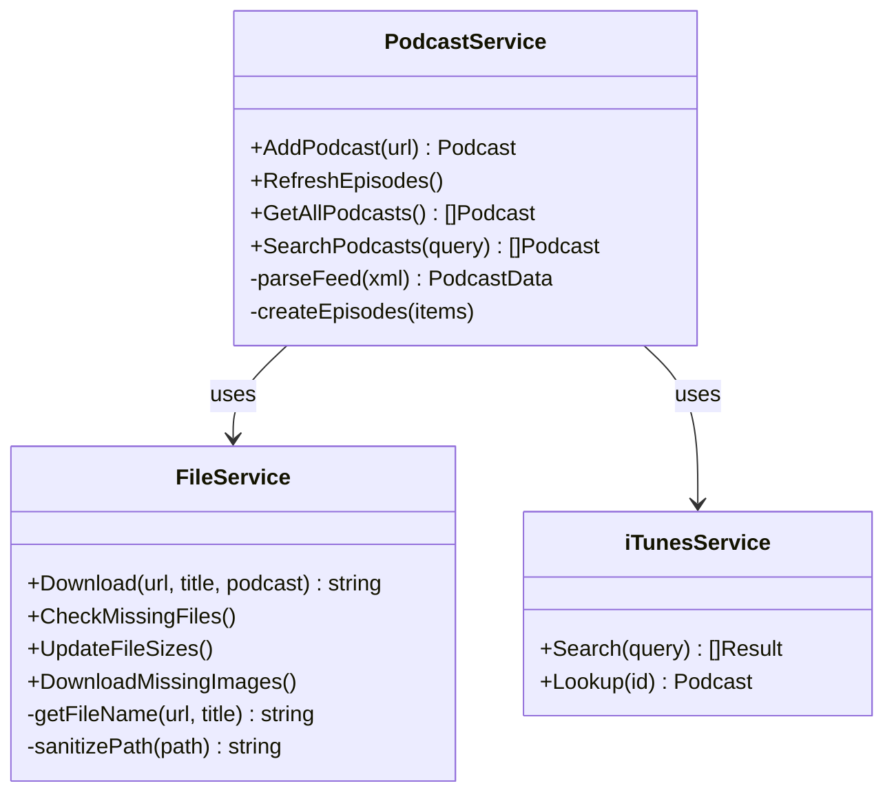

## Design Patterns Implementation

### 1. Repository Pattern (Simplified)

Database functions act as repositories:

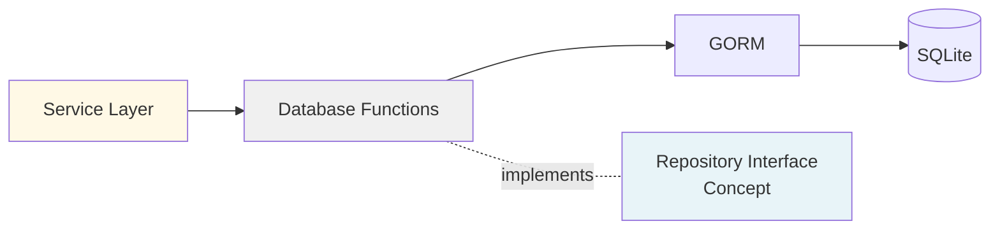

**Implementation**: `db/dbfunctions.go`
- `GetPodcastById(id, podcast)`
- `GetAllPodcasts(podcasts, sorting)`
- `AddOrUpdatePodcast(podcast)`
- `DeletePodcast(id)`

### 2. Template Method Pattern

Download workflow uses template method:

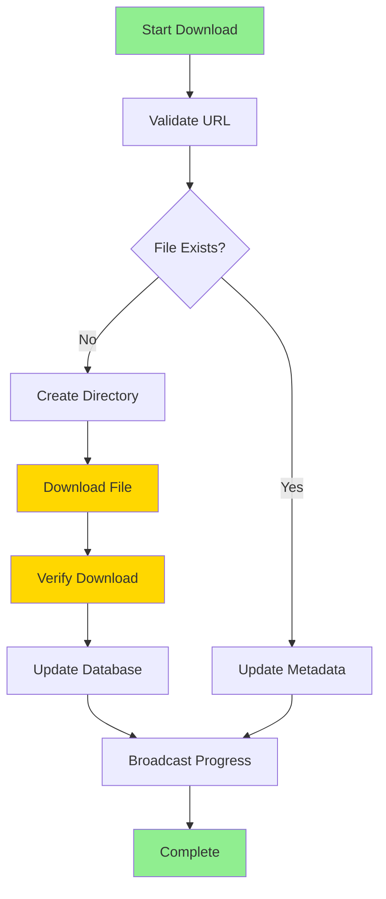

**Implementation**: `service/fileService.go:Download()`

### 3. Observer Pattern (WebSocket)

WebSocket broadcasts follow observer pattern:

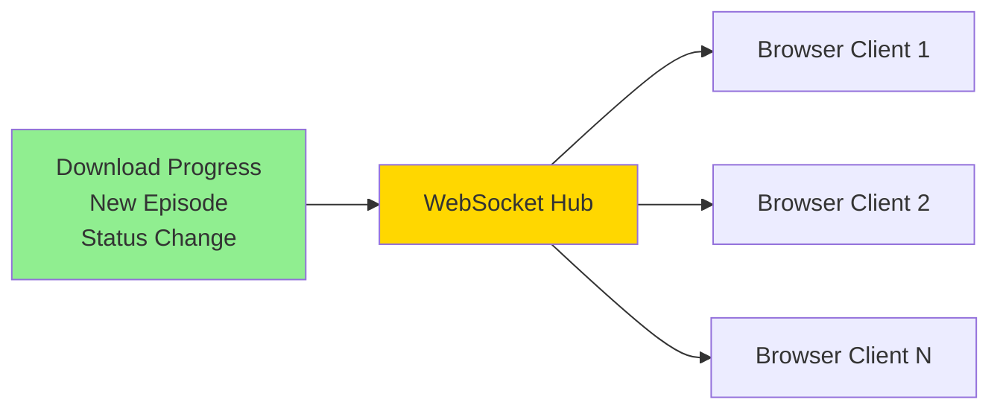

**Implementation**: `controllers/websockets.go`
- `HandleWebsocketMessages()`: Hub goroutine
- `Wshandler()`: Client connection handler
- `SendMessage()`: Broadcast to all clients

### 4. Singleton Pattern

Settings use singleton pattern:

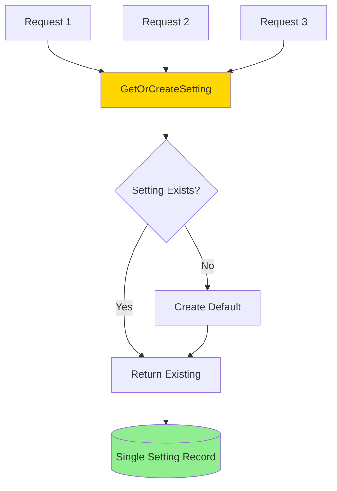

**Implementation**: `db/dbfunctions.go:GetOrCreateSetting()`

## Data Management

### Database Schema Design

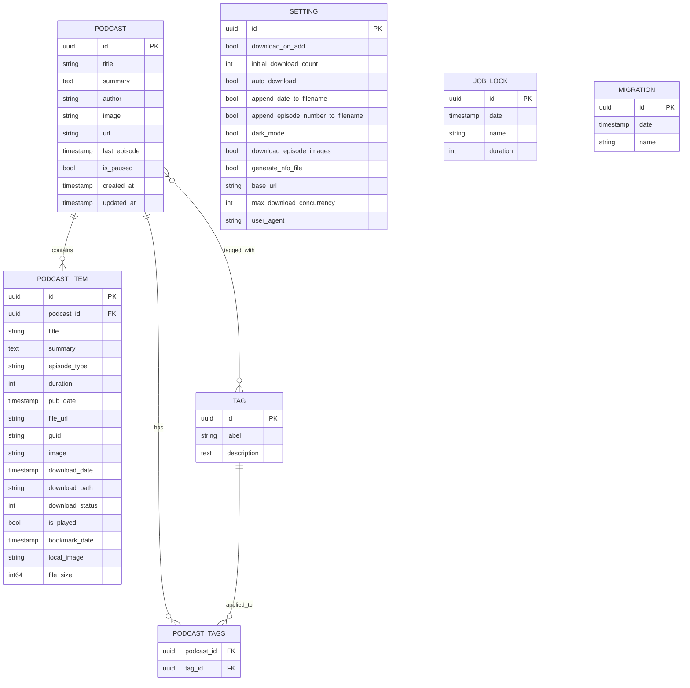

### Transaction Management

Simple transaction strategy:

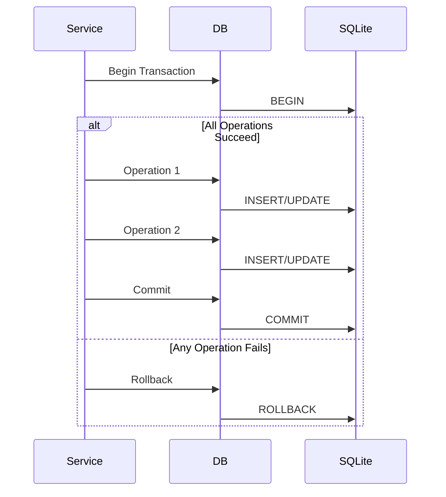

**Note**: GORM handles most transactions automatically. Explicit transactions used for:
- Multi-podcast operations
- OPML import (multiple podcasts)
- Bulk episode updates

### File Organization

```mermaid
graph TD
    Root[/assets] --> P1[Podcast 1 Folder]
    Root --> P2[Podcast 2 Folder]
    Root --> PN[Podcast N Folder]

    P1 --> E11[Episode 1.mp3]
    P1 --> E12[Episode 2.mp3]
    P1 --> E1N[Episode N.mp3]

    P2 --> E21[Episode 1.mp3]
    P2 --> E22[Episode 2.mp3]

    style Root fill:#FFD700
    style P1 fill:#90EE90
    style P2 fill:#90EE90
```

**Naming Convention**:
```
[optional-date-prefix-][optional-episode-number-]sanitized-episode-title.mp3
```

**Example**:
- Without prefixes: `great-podcast-episode-title.mp3`
- With date: `2024-01-15-great-podcast-episode-title.mp3`
- With both: `2024-01-15-001-great-podcast-episode-title.mp3`

## Background Job Design

### Job Scheduling

```mermaid
gantt
    title Background Job Schedule (Default: CHECK_FREQUENCY=30min)
    dateFormat HH:mm
    axisFormat %H:%M

    section Frequent Jobs
    Refresh Episodes       :a1, 00:00, 30m
    Check Missing Files    :a2, 00:00, 30m
    Download Images        :a3, 00:00, 30m

    section Medium Frequency
    Unlock Missed Jobs     :b1, 00:00, 60m
    Update File Sizes      :b2, 00:00, 90m

    section Low Frequency
    Create Backup          :c1, 00:00, 2880m
```

### Job Locking Mechanism

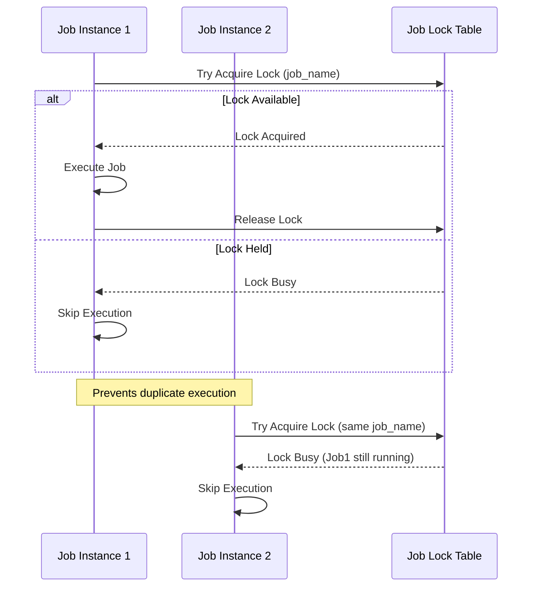

**Implementation**: `service/podcastService.go`
- `CreateLock(name, duration)`: Acquire lock
- `ReleaseLock(name)`: Release lock
- `UnlockMissedJobs()`: Clean up stale locks

### Download Queue Management

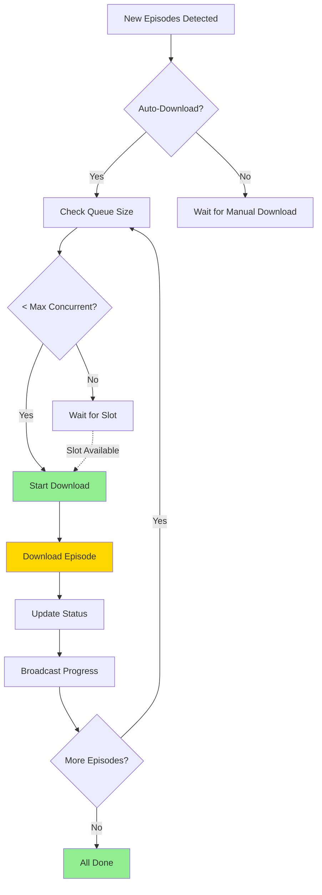

## Error Handling Strategy

### Error Classification

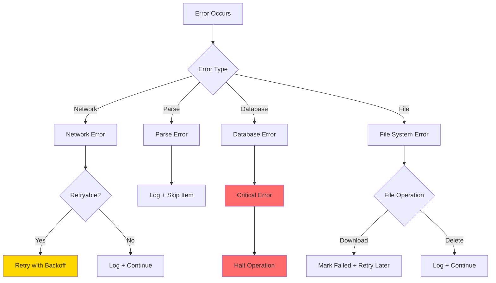

### Error Recovery

| Error Type | Strategy | User Impact |
|------------|----------|-------------|
| RSS Feed Fetch Failed | Log error, skip this refresh cycle | Podcast not updated until next cycle |
| Episode Download Failed | Mark as `NotDownloaded`, retry on next job run | Episode remains in queue |
| Database Connection Lost | Application restart required | Service interruption |
| File Write Failed | Log error, mark episode as failed | Episode not available |
| Parse Error | Log error, skip malformed item | Some episodes may not be added |

## Caching Strategy

**Current State**: No caching layer implemented

**Rationale**:
- SQLite is fast enough for read operations
- Episode files cached on disk
- RSS feeds refreshed on schedule (not real-time)
- Low concurrent user count expected

**Potential Future Caching**:
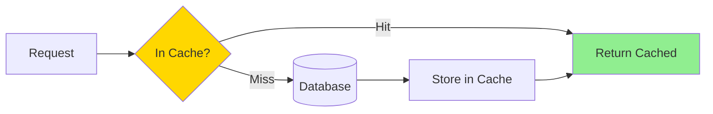

## Concurrency Control

### Download Concurrency

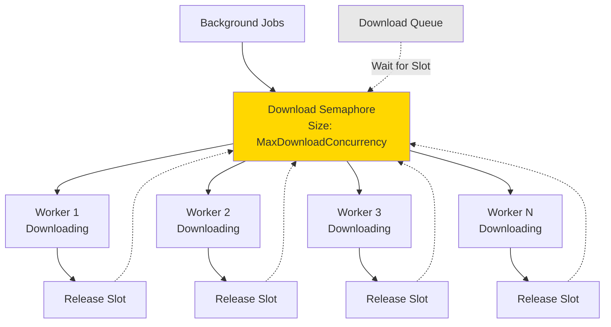

**Implementation**: Controlled by `Setting.MaxDownloadConcurrency` (default: 5)

### Database Concurrency

**SQLite Limitations**:
- Single writer at a time
- Multiple readers allowed
- Write lock blocks all operations

**Mitigation**:
- Short transactions
- Optimistic locking via GORM
- Job locking prevents duplicate writes
- Read-heavy workload minimizes contention

## Security Design

### Authentication Flow

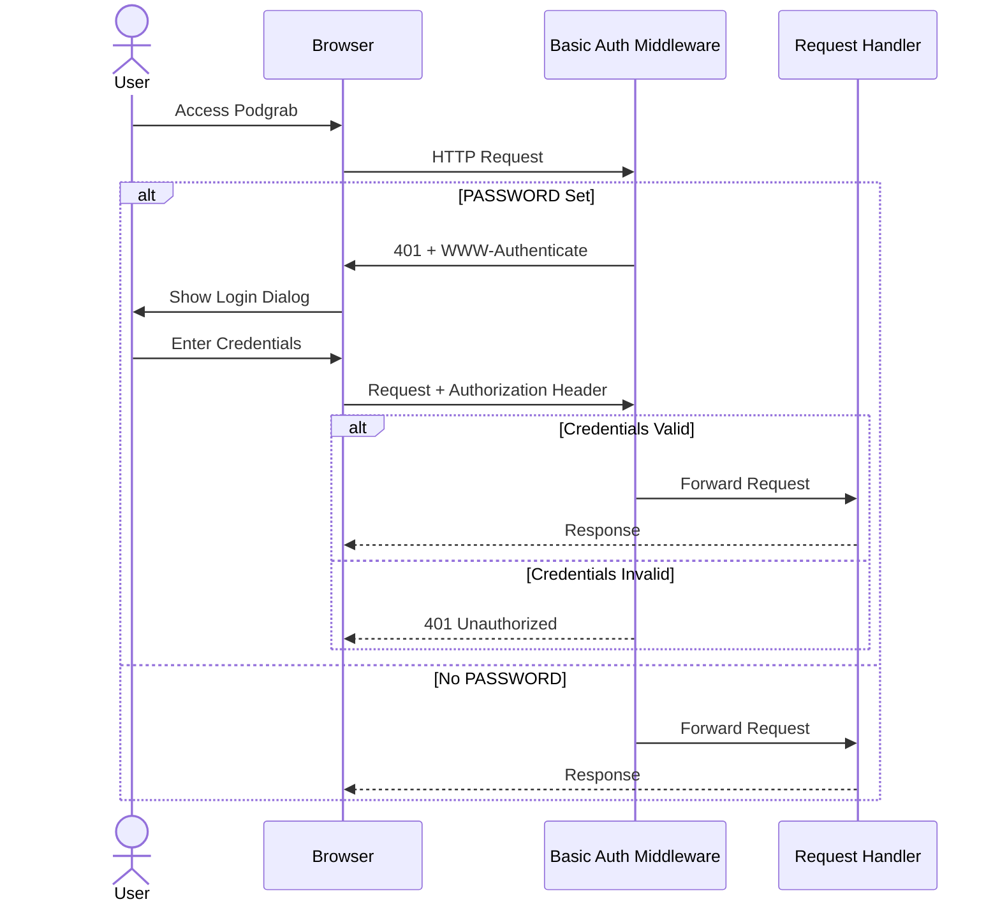

**Security Considerations**:
- Basic Auth over HTTP is insecure (use reverse proxy with HTTPS)
- No rate limiting (vulnerable to brute force)
- No session management (credentials sent with every request)
- Fixed username (`podgrab`) cannot be changed

### Input Sanitization

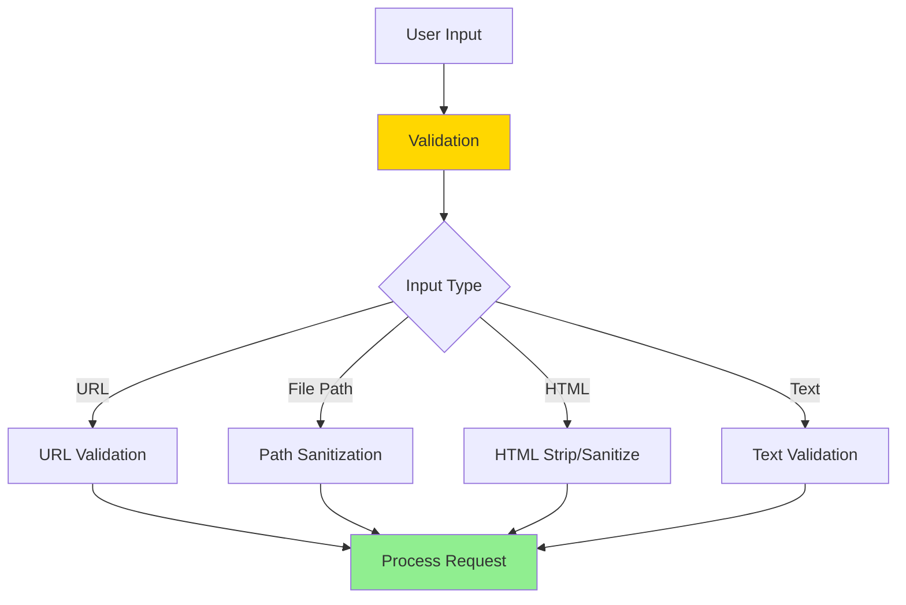

**Sanitization Functions**:
- `internal/sanitize/sanitize.go`: Path and filename sanitization
- `bluemonday`: HTML sanitization
- `html-strip-tags-go`: HTML tag removal

## Performance Optimizations

### Database Queries

**Optimizations Applied**:
1. **Indexing**: Primary keys (UUIDs), foreign keys, timestamps
2. **Eager Loading**: `Preload()` for podcast items and tags
3. **Batch Operations**: Bulk inserts for episodes
4. **Query Limits**: Pagination support (though not heavily used)

**Query Patterns**:
```sql
-- Efficient: Uses index on podcast_id
SELECT * FROM podcast_items WHERE podcast_id = ?

-- Efficient: Uses index on created_at
SELECT * FROM podcasts ORDER BY created_at DESC

-- Potentially Slow: Full table scan for text search
SELECT * FROM podcasts WHERE title LIKE '%search%'
```

### File I/O

**Optimizations**:
- Streaming downloads (not loaded into memory)
- Concurrent downloads with semaphore
- Existing file detection (skip re-download)
- Chunked file writes

### Template Rendering

**Approach**: Server-side rendering with minimal client JavaScript

**Trade-offs**:
- ✅ Lower client CPU usage
- ✅ Works without JavaScript
- ✅ Simpler codebase
- ❌ Full page reloads for navigation
- ❌ Higher server CPU usage

## Design Trade-offs

| Decision | Advantages | Disadvantages |
|----------|-----------|---------------|
| SQLite vs PostgreSQL | Simple deployment, no separate DB server | Limited concurrency, no horizontal scaling |
| Monolith vs Microservices | Simple deployment, easier development | All-or-nothing scaling, tight coupling |
| Server-side templates vs SPA | SEO-friendly, simple | Less interactive, more server load |
| Basic Auth vs OAuth | Simple setup | Less secure, limited features |
| File storage vs S3 | No cloud dependency, lower cost | Not scalable, no CDN |
| Scheduled jobs vs Message Queue | Simple implementation | Less reliable, no guaranteed execution |

## Related Documentation

- [Overview](overview.md) - High-level architecture
- [Data Flow](data-flow.md) - Request/response flows
- [Database Schema](database-schema.md) - Detailed schema
- [Development Setup](../development/setup.md) - Development environment

---

**Next Steps**: Review [Data Flow](data-flow.md) for detailed request/response patterns.