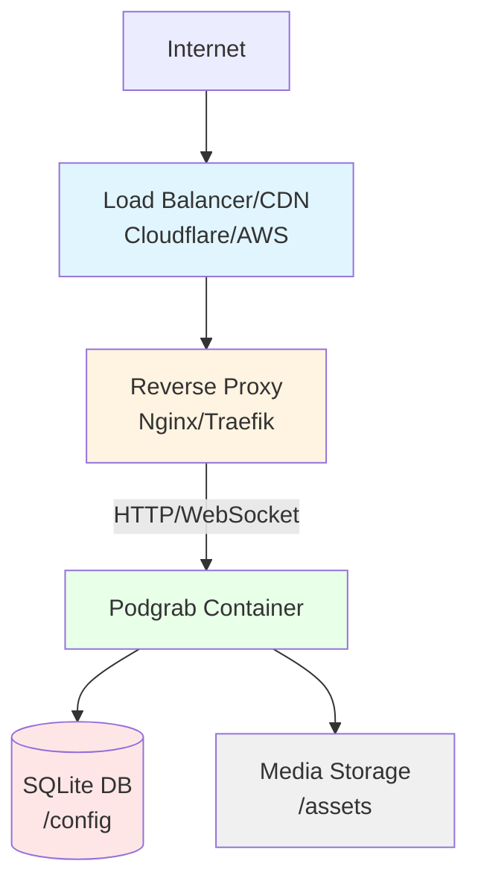
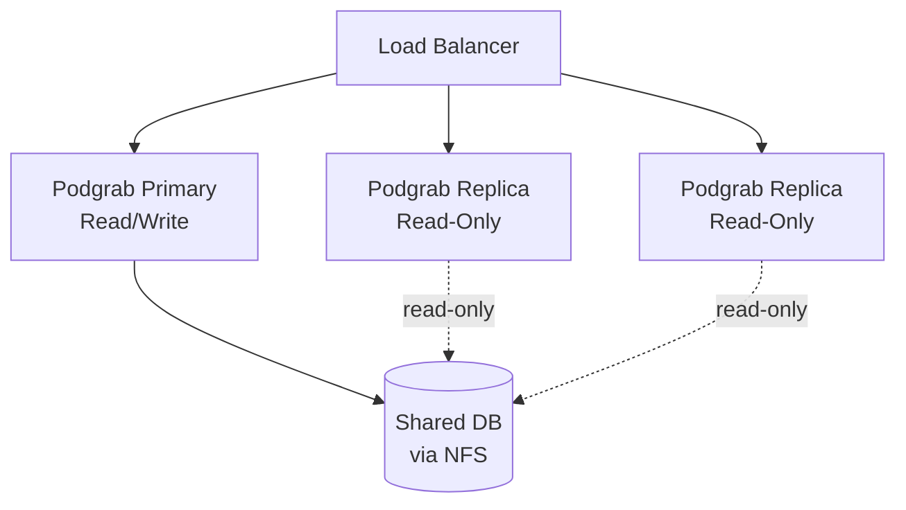

# Production Deployment Best Practices

Comprehensive guide for deploying Podgrab in production environments.

## Architecture Overview



## Reverse Proxy Configuration

### Nginx

#### Complete Configuration

```nginx
# Rate limiting
limit_req_zone $binary_remote_addr zone=podgrab_limit:10m rate=10r/s;
limit_conn_zone $binary_remote_addr zone=podgrab_conn:10m;

# Upstream
upstream podgrab {
    server 127.0.0.1:8080;
    keepalive 32;
}

server {
    listen 80;
    server_name podgrab.example.com;

    # Redirect HTTP to HTTPS
    return 301 https://$server_name$request_uri;
}

server {
    listen 443 ssl http2;
    server_name podgrab.example.com;

    # SSL Configuration
    ssl_certificate /etc/letsencrypt/live/podgrab.example.com/fullchain.pem;
    ssl_certificate_key /etc/letsencrypt/live/podgrab.example.com/privkey.pem;
    ssl_session_timeout 1d;
    ssl_session_cache shared:SSL:50m;
    ssl_session_tickets off;

    # Modern SSL configuration
    ssl_protocols TLSv1.2 TLSv1.3;
    ssl_ciphers ECDHE-RSA-AES128-GCM-SHA256:ECDHE-RSA-AES256-GCM-SHA384;
    ssl_prefer_server_ciphers off;

    # HSTS
    add_header Strict-Transport-Security "max-age=63072000" always;

    # Security Headers
    add_header X-Frame-Options "SAMEORIGIN" always;
    add_header X-Content-Type-Options "nosniff" always;
    add_header X-XSS-Protection "1; mode=block" always;
    add_header Referrer-Policy "no-referrer-when-downgrade" always;

    # Client body size (for OPML uploads)
    client_max_body_size 10M;

    # Timeouts
    proxy_connect_timeout 60s;
    proxy_send_timeout 60s;
    proxy_read_timeout 60s;

    # Rate limiting
    limit_req zone=podgrab_limit burst=20 nodelay;
    limit_conn podgrab_conn 10;

    # WebSocket support
    location /ws {
        proxy_pass http://podgrab/ws;
        proxy_http_version 1.1;
        proxy_set_header Upgrade $http_upgrade;
        proxy_set_header Connection "upgrade";
        proxy_set_header Host $host;
        proxy_set_header X-Real-IP $remote_addr;
        proxy_set_header X-Forwarded-For $proxy_add_x_forwarded_for;
        proxy_set_header X-Forwarded-Proto $scheme;

        # WebSocket timeouts
        proxy_read_timeout 3600s;
        proxy_send_timeout 3600s;
    }

    # Static assets (caching)
    location /webassets {
        proxy_pass http://podgrab/webassets;
        proxy_http_version 1.1;
        proxy_set_header Connection "";
        proxy_set_header Host $host;

        # Cache static assets
        expires 1y;
        add_header Cache-Control "public, immutable";
    }

    # Media files (caching)
    location /assets {
        proxy_pass http://podgrab/assets;
        proxy_http_version 1.1;
        proxy_set_header Connection "";

        # Cache media
        expires 7d;
        add_header Cache-Control "public";

        # Enable range requests for audio streaming
        proxy_set_header Range $http_range;
        proxy_set_header If-Range $http_if_range;
    }

    # API and pages
    location / {
        proxy_pass http://podgrab;
        proxy_http_version 1.1;
        proxy_set_header Connection "";
        proxy_set_header Host $host;
        proxy_set_header X-Real-IP $remote_addr;
        proxy_set_header X-Forwarded-For $proxy_add_x_forwarded_for;
        proxy_set_header X-Forwarded-Proto $scheme;

        # No caching for dynamic content
        add_header Cache-Control "no-cache, no-store, must-revalidate";
    }

    # Access logging
    access_log /var/log/nginx/podgrab_access.log;
    error_log /var/log/nginx/podgrab_error.log;
}
```

#### Testing Configuration

```bash
# Test syntax
sudo nginx -t

# Reload
sudo systemctl reload nginx

# Check logs
sudo tail -f /var/log/nginx/podgrab_error.log
```

### Traefik

#### docker-compose.yml

```yaml
version: '3.8'

services:
  traefik:
    image: traefik:v2.10
    container_name: traefik
    command:
      - "--api.dashboard=true"
      - "--providers.docker=true"
      - "--providers.docker.exposedbydefault=false"
      - "--entrypoints.web.address=:80"
      - "--entrypoints.websecure.address=:443"
      - "--certificatesresolvers.letsencrypt.acme.tlschallenge=true"
      - "--certificatesresolvers.letsencrypt.acme.email=admin@example.com"
      - "--certificatesresolvers.letsencrypt.acme.storage=/letsencrypt/acme.json"
    ports:
      - "80:80"
      - "443:443"
    volumes:
      - /var/run/docker.sock:/var/run/docker.sock:ro
      - ./letsencrypt:/letsencrypt
    networks:
      - traefik
    restart: unless-stopped

  podgrab:
    image: akhilrex/podgrab:latest
    container_name: podgrab
    volumes:
      - ./config:/config
      - ./data:/assets
    environment:
      - PASSWORD=${PODGRAB_PASSWORD}
      - CHECK_FREQUENCY=30
    labels:
      - "traefik.enable=true"

      # HTTP to HTTPS redirect
      - "traefik.http.routers.podgrab-http.rule=Host(`podgrab.example.com`)"
      - "traefik.http.routers.podgrab-http.entrypoints=web"
      - "traefik.http.routers.podgrab-http.middlewares=redirect-to-https"

      # HTTPS
      - "traefik.http.routers.podgrab.rule=Host(`podgrab.example.com`)"
      - "traefik.http.routers.podgrab.entrypoints=websecure"
      - "traefik.http.routers.podgrab.tls.certresolver=letsencrypt"

      # Middlewares
      - "traefik.http.middlewares.redirect-to-https.redirectscheme.scheme=https"
      - "traefik.http.middlewares.podgrab-headers.headers.sslredirect=true"
      - "traefik.http.middlewares.podgrab-headers.headers.stsSeconds=31536000"
      - "traefik.http.middlewares.podgrab-headers.headers.frameDeny=true"
      - "traefik.http.middlewares.podgrab-headers.headers.contentTypeNosniff=true"
      - "traefik.http.routers.podgrab.middlewares=podgrab-headers"

      # Service
      - "traefik.http.services.podgrab.loadbalancer.server.port=8080"

    networks:
      - traefik
    restart: unless-stopped

networks:
  traefik:
    external: true
```

### Caddy

#### Caddyfile

```caddy
podgrab.example.com {
    # Automatic HTTPS
    reverse_proxy podgrab:8080 {
        # WebSocket support
        header_up Upgrade {http.request.header.Upgrade}
        header_up Connection {http.request.header.Connection}
    }

    # Security headers
    header {
        Strict-Transport-Security "max-age=31536000;"
        X-Frame-Options "SAMEORIGIN"
        X-Content-Type-Options "nosniff"
        X-XSS-Protection "1; mode=block"
        Referrer-Policy "no-referrer-when-downgrade"
    }

    # Rate limiting
    rate_limit {
        zone podgrab {
            key {remote_host}
            events 100
            window 1m
        }
    }

    # Logging
    log {
        output file /var/log/caddy/podgrab.log
        format json
    }
}
```

## SSL/TLS Configuration

### Let's Encrypt with Certbot

#### Initial Setup

```bash
# Install certbot
sudo apt-get install certbot python3-certbot-nginx

# Obtain certificate
sudo certbot --nginx -d podgrab.example.com
```

#### Auto-Renewal

```bash
# Test renewal
sudo certbot renew --dry-run

# Cron job (automatically added by certbot)
0 0,12 * * * certbot renew --quiet --post-hook "systemctl reload nginx"
```

### Cloudflare SSL

If using Cloudflare:

1. Set SSL/TLS mode to "Full (strict)"
2. Enable "Always Use HTTPS"
3. Enable "Automatic HTTPS Rewrites"
4. Configure Origin Server Certificate

## Storage Configuration

### Local Storage

#### SSD for Database

```yaml
volumes:
  - /mnt/ssd/podgrab/config:/config  # Database on SSD
  - /mnt/hdd/podgrab/data:/assets    # Media on HDD (cheaper)
```

#### Filesystem Recommendations

- **ext4**: Good general purpose
- **XFS**: Better for large files
- **ZFS**: Advanced features (snapshots, compression)
- **Btrfs**: CoW filesystem with snapshots

### Network Storage (NAS)

#### NFS Mount

```bash
# Install NFS client
sudo apt-get install nfs-common

# Create mount point
sudo mkdir -p /mnt/nas/podgrab

# Mount
sudo mount -t nfs nas.local:/volume1/podgrab /mnt/nas/podgrab

# Permanent mount in /etc/fstab
nas.local:/volume1/podgrab /mnt/nas/podgrab nfs defaults,_netdev 0 0
```

#### SMB/CIFS Mount

```bash
# Install CIFS utils
sudo apt-get install cifs-utils

# Mount
sudo mount -t cifs //nas.local/podgrab /mnt/nas/podgrab -o username=user,password=pass

# Permanent mount in /etc/fstab
//nas.local/podgrab /mnt/nas/podgrab cifs username=user,password=pass,_netdev 0 0
```

### S3-Compatible Storage (Advanced)

For media offloading:

```bash
# Install s3fs
sudo apt-get install s3fs

# Configure credentials
echo ACCESS_KEY:SECRET_KEY > ~/.passwd-s3fs
chmod 600 ~/.passwd-s3fs

# Mount
s3fs mybucket /mnt/s3 -o passwd_file=~/.passwd-s3fs,url=https://s3.example.com
```

## Backup Strategy

### Database Backups

#### Podgrab Built-in Backups

Automatic backups created every 2 days:
```
/config/backups/podgrab_backup_YYYY.MM.DD
```

#### External Backup Script

```bash
#!/bin/bash
# backup-podgrab.sh

BACKUP_DIR="/backups/podgrab"
DATE=$(date +%Y%m%d_%H%M%S)
CONFIG_DIR="/path/to/config"

# Create backup directory
mkdir -p "$BACKUP_DIR"

# Stop container (optional, for consistency)
docker-compose -f /path/to/docker-compose.yml stop podgrab

# Backup database
cp "$CONFIG_DIR/podgrab.db" "$BACKUP_DIR/podgrab_$DATE.db"

# Start container
docker-compose -f /path/to/docker-compose.yml start podgrab

# Compress
gzip "$BACKUP_DIR/podgrab_$DATE.db"

# Upload to remote (optional)
# aws s3 cp "$BACKUP_DIR/podgrab_$DATE.db.gz" s3://my-backups/podgrab/

# Cleanup old backups (keep 30 days)
find "$BACKUP_DIR" -name "podgrab_*.db.gz" -mtime +30 -delete

echo "Backup completed: podgrab_$DATE.db.gz"
```

#### Automated Backups

```bash
# Add to crontab
crontab -e

# Daily backup at 3 AM
0 3 * * * /path/to/backup-podgrab.sh >> /var/log/podgrab-backup.log 2>&1
```

### Media Backups

Media files are large; consider:

- **Selective backup**: Only downloaded episodes
- **Cloud sync**: Rclone to cloud storage
- **Snapshot-based**: ZFS/Btrfs snapshots

#### Rclone to Cloud

```bash
# Install rclone
curl https://rclone.org/install.sh | sudo bash

# Configure remote
rclone config

# Sync to cloud
rclone sync /path/to/assets remote:podgrab-media \
  --transfers 4 \
  --checkers 8 \
  --progress
```

## Monitoring

### Uptime Monitoring

#### UptimeRobot

```
Monitor URL: https://podgrab.example.com
Type: HTTP(s)
Interval: 5 minutes
```

#### Healthchecks.io

```bash
# Create check at healthchecks.io
# Add to crontab
*/5 * * * * curl -fsS --retry 3 https://hc-ping.com/your-uuid > /dev/null
```

### Resource Monitoring

#### Prometheus + Grafana

**docker-compose.yml:**

```yaml
services:
  prometheus:
    image: prom/prometheus
    volumes:
      - ./prometheus.yml:/etc/prometheus/prometheus.yml
      - prometheus-data:/prometheus
    command:
      - '--config.file=/etc/prometheus/prometheus.yml'
    ports:
      - "9090:9090"

  grafana:
    image: grafana/grafana
    volumes:
      - grafana-data:/var/lib/grafana
    ports:
      - "3000:3000"
    environment:
      - GF_SECURITY_ADMIN_PASSWORD=admin

  cadvisor:
    image: gcr.io/cadvisor/cadvisor
    volumes:
      - /:/rootfs:ro
      - /var/run:/var/run:ro
      - /sys:/sys:ro
      - /var/lib/docker/:/var/lib/docker:ro
    ports:
      - "8081:8080"

volumes:
  prometheus-data:
  grafana-data:
```

**prometheus.yml:**

```yaml
global:
  scrape_interval: 15s

scrape_configs:
  - job_name: 'cadvisor'
    static_configs:
      - targets: ['cadvisor:8080']
```

### Log Aggregation

#### Loki + Promtail

```yaml
services:
  loki:
    image: grafana/loki
    ports:
      - "3100:3100"
    volumes:
      - loki-data:/loki

  promtail:
    image: grafana/promtail
    volumes:
      - /var/lib/docker/containers:/var/lib/docker/containers:ro
      - ./promtail-config.yml:/etc/promtail/config.yml
    command: -config.file=/etc/promtail/config.yml

volumes:
  loki-data:
```

## Performance Optimization

### Database Optimization

#### SQLite Configuration

Create `/config/podgrab.db-wal` for WAL mode (Write-Ahead Logging):

```sql
PRAGMA journal_mode=WAL;
PRAGMA synchronous=NORMAL;
PRAGMA cache_size=-64000;  -- 64MB cache
PRAGMA temp_store=MEMORY;
```

#### Regular Maintenance

```bash
# Weekly database optimization
0 2 * * 0 docker exec podgrab sqlite3 /config/podgrab.db "VACUUM; ANALYZE;"
```

### CDN Integration

#### Cloudflare

1. Add site to Cloudflare
2. Point DNS to your server
3. Enable caching for `/assets` and `/webassets`
4. Create Page Rule:
   - URL: `podgrab.example.com/assets/*`
   - Cache Level: Cache Everything
   - Edge Cache TTL: 1 month

#### Custom CDN

Serve `/assets` from CDN:

```nginx
location /assets {
    # Redirect to CDN
    return 301 https://cdn.example.com/podgrab/assets$request_uri;
}
```

### Download Optimization

#### Concurrent Downloads

In Podgrab settings:
- **2 CPU cores**: MaxDownloadConcurrency = 3
- **4 CPU cores**: MaxDownloadConcurrency = 5
- **8+ CPU cores**: MaxDownloadConcurrency = 10

#### Network Tuning

```bash
# Increase TCP buffer sizes
sudo sysctl -w net.core.rmem_max=16777216
sudo sysctl -w net.core.wmem_max=16777216
sudo sysctl -w net.ipv4.tcp_rmem='4096 87380 16777216'
sudo sysctl -w net.ipv4.tcp_wmem='4096 65536 16777216'
```

## Security Hardening

### Container Security

#### Run as Non-Root

Podgrab already runs as UID 1000, but verify:

```yaml
user: "1000:1000"
read_only: true  # Make container filesystem read-only
tmpfs:
  - /tmp
```

#### Security Options

```yaml
security_opt:
  - no-new-privileges:true
cap_drop:
  - ALL
cap_add:
  - NET_BIND_SERVICE  # Only if binding to port 80/443
```

### Firewall Configuration

#### UFW (Ubuntu)

```bash
# Allow SSH
sudo ufw allow 22/tcp

# Allow HTTP/HTTPS
sudo ufw allow 80/tcp
sudo ufw allow 443/tcp

# Enable firewall
sudo ufw enable

# Check status
sudo ufw status
```

#### iptables

```bash
# Allow established connections
iptables -A INPUT -m state --state ESTABLISHED,RELATED -j ACCEPT

# Allow SSH
iptables -A INPUT -p tcp --dport 22 -j ACCEPT

# Allow HTTP/HTTPS
iptables -A INPUT -p tcp --dport 80 -j ACCEPT
iptables -A INPUT -p tcp --dport 443 -j ACCEPT

# Drop everything else
iptables -P INPUT DROP
```

### Fail2Ban

Protect against brute force attacks:

```bash
# Install
sudo apt-get install fail2ban

# Configure
sudo nano /etc/fail2ban/jail.local
```

**jail.local:**

```ini
[nginx-podgrab]
enabled = true
port = http,https
filter = nginx-podgrab
logpath = /var/log/nginx/podgrab_access.log
maxretry = 5
bantime = 3600
```

**Filter (/etc/fail2ban/filter.d/nginx-podgrab.conf):**

```ini
[Definition]
failregex = ^<HOST> .* "(GET|POST|HEAD).*" 401
ignoreregex =
```

## High Availability

### Load Balancing (Read-Only)

**Note:** Podgrab uses SQLite which doesn't support multiple writers. Read-only replicas possible:



**Limitations:**
- Only primary can write
- Replicas for serving media/reads only
- Not true HA (primary is SPOF)

### Alternative: Active-Passive

Use keepalived for failover:

```
Primary: 192.168.1.100 (VIP: 192.168.1.10)
Standby: 192.168.1.101 (VIP: 192.168.1.10)
```

## Disaster Recovery

### Recovery Plan

1. **Restore from backup:**
   ```bash
   # Stop current instance
   docker-compose down

   # Restore database
   gunzip -c backup.db.gz > /config/podgrab.db

   # Restart
   docker-compose up -d
   ```

2. **Verify data:**
   - Check podcast list
   - Verify episode downloads
   - Test playback

3. **Re-sync if needed:**
   - Refresh all podcasts
   - Re-download missing episodes

### RTO/RPO Targets

- **RTO (Recovery Time Objective):** 1 hour
- **RPO (Recovery Point Objective):** 24 hours (daily backups)

## Scaling Considerations

### Vertical Scaling

Podgrab is single-instance; scale by increasing resources:

```yaml
deploy:
  resources:
    limits:
      cpus: '8.0'
      memory: 4G
```

### Horizontal Scaling (Not Supported)

SQLite limitation prevents horizontal scaling. For very large deployments, consider:

- Separate instances per podcast category
- API proxy to multiple Podgrab instances
- Community fork with PostgreSQL support

## Related Documentation

- [Docker Deployment](docker.md) - Container setup
- [Configuration Guide](../guides/configuration.md) - Settings reference
- [User Guide](../guides/user-guide.md) - Application usage
